«В один клик» - это интернет-магазин, который продаёт разные товары: для детей, для дома, мелкую бытовую технику, косметику и продукты.  

Цель данного проекта: разработать решение, которое позволит персонализировать предложения постоянным клиентам, чтобы увеличить их покупательскую активность.

Задачи проекта:  

1.   Нужно построить модель, которая предскажет вероятность снижения покупательской активности клиента в следующие три месяца.
2.   В исследование нужно включить дополнительные данные финансового департамента о прибыльности клиента: какой доход каждый покупатель приносил компании за последние три месяца.  
3. Используя данные модели и данные о прибыльности клиентов, нужно выделить сегменты покупателей и разработать для них персонализированные предложения.


**Шаг 1. Загрузка данных**


```python
!pip install shap -q
```


```python
!pip install phik -q
```


```python
!pip install -Uq scikit-learn

```


```python
import pandas as pd
import numpy as np
from phik import resources, report
import shap
import matplotlib.pyplot as plt
import seaborn as sns
from sklearn.model_selection import (
    train_test_split,
    GridSearchCV,
    RandomizedSearchCV)
from sklearn.pipeline import Pipeline
from sklearn.preprocessing import (
    OneHotEncoder,
    StandardScaler,
    MinMaxScaler,
    OrdinalEncoder,
    LabelEncoder)
from sklearn.compose import ColumnTransformer
from sklearn.metrics import roc_auc_score, f1_score
from sklearn.linear_model import LogisticRegression
from sklearn.neighbors import KNeighborsClassifier
from sklearn.tree import DecisionTreeClassifier
from sklearn.svm import SVC
from sklearn.impute import SimpleImputer


```python
market_file = pd.read_csv('https://code.s3.yandex.net/datasets/market_file.csv')
market_money = pd.read_csv('https://code.s3.yandex.net/datasets/market_money.csv')
market_time = pd.read_csv('https://code.s3.yandex.net/datasets/market_time.csv')
money = pd.read_csv('https://code.s3.yandex.net/datasets/money.csv', sep=';', decimal=',')
```


```python
display(market_file.head())

```


<div>
<style scoped>
    .dataframe tbody tr th:only-of-type {
        vertical-align: middle;
    }

    .dataframe tbody tr th {
        vertical-align: top;
    }

    .dataframe thead th {
        text-align: right;
    }
</style>
<table border="1" class="dataframe">
  <thead>
    <tr style="text-align: right;">
      <th></th>
      <th>id</th>
      <th>Покупательская активность</th>
      <th>Тип сервиса</th>
      <th>Разрешить сообщать</th>
      <th>Маркет_актив_6_мес</th>
      <th>Маркет_актив_тек_мес</th>
      <th>Длительность</th>
      <th>Акционные_покупки</th>
      <th>Популярная_категория</th>
      <th>Средний_просмотр_категорий_за_визит</th>
      <th>Неоплаченные_продукты_штук_квартал</th>
      <th>Ошибка_сервиса</th>
      <th>Страниц_за_визит</th>
    </tr>
  </thead>
  <tbody>
    <tr>
      <th>0</th>
      <td>215348</td>
      <td>Снизилась</td>
      <td>премиум</td>
      <td>да</td>
      <td>3.4</td>
      <td>5</td>
      <td>121</td>
      <td>0.00</td>
      <td>Товары для детей</td>
      <td>6</td>
      <td>2</td>
      <td>1</td>
      <td>5</td>
    </tr>
    <tr>
      <th>1</th>
      <td>215349</td>
      <td>Снизилась</td>
      <td>премиум</td>
      <td>да</td>
      <td>4.4</td>
      <td>4</td>
      <td>819</td>
      <td>0.75</td>
      <td>Товары для детей</td>
      <td>4</td>
      <td>4</td>
      <td>2</td>
      <td>5</td>
    </tr>
    <tr>
      <th>2</th>
      <td>215350</td>
      <td>Снизилась</td>
      <td>стандартт</td>
      <td>нет</td>
      <td>4.9</td>
      <td>3</td>
      <td>539</td>
      <td>0.14</td>
      <td>Домашний текстиль</td>
      <td>5</td>
      <td>2</td>
      <td>1</td>
      <td>5</td>
    </tr>
    <tr>
      <th>3</th>
      <td>215351</td>
      <td>Снизилась</td>
      <td>стандартт</td>
      <td>да</td>
      <td>3.2</td>
      <td>5</td>
      <td>896</td>
      <td>0.99</td>
      <td>Товары для детей</td>
      <td>5</td>
      <td>0</td>
      <td>6</td>
      <td>4</td>
    </tr>
    <tr>
      <th>4</th>
      <td>215352</td>
      <td>Снизилась</td>
      <td>стандартт</td>
      <td>нет</td>
      <td>5.1</td>
      <td>3</td>
      <td>1064</td>
      <td>0.94</td>
      <td>Товары для детей</td>
      <td>3</td>
      <td>2</td>
      <td>3</td>
      <td>2</td>
    </tr>
  </tbody>
</table>
</div>


```python
market_file.info()

```

    <class 'pandas.core.frame.DataFrame'>
    RangeIndex: 1300 entries, 0 to 1299
    Data columns (total 13 columns):
     #   Column                               Non-Null Count  Dtype  
    ---  ------                               --------------  -----  
     0   id                                   1300 non-null   int64  
     1   Покупательская активность            1300 non-null   object 
     2   Тип сервиса                          1300 non-null   object 
     3   Разрешить сообщать                   1300 non-null   object 
     4   Маркет_актив_6_мес                   1300 non-null   float64
     5   Маркет_актив_тек_мес                 1300 non-null   int64  
     6   Длительность                         1300 non-null   int64  
     7   Акционные_покупки                    1300 non-null   float64
     8   Популярная_категория                 1300 non-null   object 
     9   Средний_просмотр_категорий_за_визит  1300 non-null   int64  
     10  Неоплаченные_продукты_штук_квартал   1300 non-null   int64  
     11  Ошибка_сервиса                       1300 non-null   int64  
     12  Страниц_за_визит                     1300 non-null   int64  
    dtypes: float64(2), int64(7), object(4)
    memory usage: 132.2+ KB


```python
display(market_money.head())
```


<div>
<style scoped>
    .dataframe tbody tr th:only-of-type {
        vertical-align: middle;
    }

    .dataframe tbody tr th {
        vertical-align: top;
    }

    .dataframe thead th {
        text-align: right;
    }
</style>
<table border="1" class="dataframe">
  <thead>
    <tr style="text-align: right;">
      <th></th>
      <th>id</th>
      <th>Период</th>
      <th>Выручка</th>
    </tr>
  </thead>
  <tbody>
    <tr>
      <th>0</th>
      <td>215348</td>
      <td>препредыдущий_месяц</td>
      <td>0.0</td>
    </tr>
    <tr>
      <th>1</th>
      <td>215348</td>
      <td>текущий_месяц</td>
      <td>3293.1</td>
    </tr>
    <tr>
      <th>2</th>
      <td>215348</td>
      <td>предыдущий_месяц</td>
      <td>0.0</td>
    </tr>
    <tr>
      <th>3</th>
      <td>215349</td>
      <td>препредыдущий_месяц</td>
      <td>4472.0</td>
    </tr>
    <tr>
      <th>4</th>
      <td>215349</td>
      <td>текущий_месяц</td>
      <td>4971.6</td>
    </tr>
  </tbody>
</table>
</div>


```python
market_money.info()
```

    <class 'pandas.core.frame.DataFrame'>
    RangeIndex: 3900 entries, 0 to 3899
    Data columns (total 3 columns):
     #   Column   Non-Null Count  Dtype  
    ---  ------   --------------  -----  
     0   id       3900 non-null   int64  
     1   Период   3900 non-null   object 
     2   Выручка  3900 non-null   float64
    dtypes: float64(1), int64(1), object(1)
    memory usage: 91.5+ KB


```python
display(market_time.head())
```


<div>
<style scoped>
    .dataframe tbody tr th:only-of-type {
        vertical-align: middle;
    }

    .dataframe tbody tr th {
        vertical-align: top;
    }

    .dataframe thead th {
        text-align: right;
    }
</style>
<table border="1" class="dataframe">
  <thead>
    <tr style="text-align: right;">
      <th></th>
      <th>id</th>
      <th>Период</th>
      <th>минут</th>
    </tr>
  </thead>
  <tbody>
    <tr>
      <th>0</th>
      <td>215348</td>
      <td>текущий_месяц</td>
      <td>14</td>
    </tr>
    <tr>
      <th>1</th>
      <td>215348</td>
      <td>предыдцщий_месяц</td>
      <td>13</td>
    </tr>
    <tr>
      <th>2</th>
      <td>215349</td>
      <td>текущий_месяц</td>
      <td>10</td>
    </tr>
    <tr>
      <th>3</th>
      <td>215349</td>
      <td>предыдцщий_месяц</td>
      <td>12</td>
    </tr>
    <tr>
      <th>4</th>
      <td>215350</td>
      <td>текущий_месяц</td>
      <td>13</td>
    </tr>
  </tbody>
</table>
</div>


```python
market_time.info()
```

    <class 'pandas.core.frame.DataFrame'>
    RangeIndex: 2600 entries, 0 to 2599
    Data columns (total 3 columns):
     #   Column  Non-Null Count  Dtype 
    ---  ------  --------------  ----- 
     0   id      2600 non-null   int64 
     1   Период  2600 non-null   object
     2   минут   2600 non-null   int64 
    dtypes: int64(2), object(1)
    memory usage: 61.1+ KB


```python
display(money.head())
```


<div>
<style scoped>
    .dataframe tbody tr th:only-of-type {
        vertical-align: middle;
    }

    .dataframe tbody tr th {
        vertical-align: top;
    }

    .dataframe thead th {
        text-align: right;
    }
</style>
<table border="1" class="dataframe">
  <thead>
    <tr style="text-align: right;">
      <th></th>
      <th>id</th>
      <th>Прибыль</th>
    </tr>
  </thead>
  <tbody>
    <tr>
      <th>0</th>
      <td>215348</td>
      <td>0.98</td>
    </tr>
    <tr>
      <th>1</th>
      <td>215349</td>
      <td>4.16</td>
    </tr>
    <tr>
      <th>2</th>
      <td>215350</td>
      <td>3.13</td>
    </tr>
    <tr>
      <th>3</th>
      <td>215351</td>
      <td>4.87</td>
    </tr>
    <tr>
      <th>4</th>
      <td>215352</td>
      <td>4.21</td>
    </tr>
  </tbody>
</table>
</div>


```python
money.info()
```

    <class 'pandas.core.frame.DataFrame'>
    RangeIndex: 1300 entries, 0 to 1299
    Data columns (total 2 columns):
     #   Column   Non-Null Count  Dtype  
    ---  ------   --------------  -----  
     0   id       1300 non-null   int64  
     1   Прибыль  1300 non-null   float64
    dtypes: float64(1), int64(1)
    memory usage: 20.4 KB


Вывод. Данные, которые мы получили, соответствуют описанным и готовы для дальгнйшего использования в проекте.


**Шаг 2. Предобработка данных**


```python
for i in [market_file, market_money, market_time, money]:
    display(i.duplicated().sum())
```


    0


    0


    0


    0


Явных дубликатов в датасетах нет.


```python
for i in [market_file, market_money, market_time, money]:
  display(i.columns)
```


    Index(['id', 'Покупательская активность', 'Тип сервиса', 'Разрешить сообщать',
           'Маркет_актив_6_мес', 'Маркет_актив_тек_мес', 'Длительность',
           'Акционные_покупки', 'Популярная_категория',
           'Средний_просмотр_категорий_за_визит',
           'Неоплаченные_продукты_штук_квартал', 'Ошибка_сервиса',
           'Страниц_за_визит'],
          dtype='object')


    Index(['id', 'Период', 'Выручка'], dtype='object')


    Index(['id', 'Период', 'минут'], dtype='object')


    Index(['id', 'Прибыль'], dtype='object')


```python
for i in market_file.columns:
       if market_file[i].dtype == 'object':
        unique_val = market_file[i].unique()
        display(unique_val)

```


    array(['Снизилась', 'Прежний уровень'], dtype=object)


    array(['премиум', 'стандартт', 'стандарт'], dtype=object)


    array(['да', 'нет'], dtype=object)


    array(['Товары для детей', 'Домашний текстиль', 'Косметика и аксесуары',
           'Техника для красоты и здоровья', 'Кухонная посуда',
           'Мелкая бытовая техника и электроника'], dtype=object)


```python
market_file['Тип сервиса'] = market_file['Тип сервиса'].replace('стандартт', 'стандарт')
```

```python
for i in market_money.columns:
       if market_money[i].dtype == 'object':
        unique_val = market_money[i].unique()
        display(unique_val)
```


    array(['препредыдущий_месяц', 'текущий_месяц', 'предыдущий_месяц'],
          dtype=object)


```python
for i in market_time.columns:
       if market_time[i].dtype == 'object':
        unique_val = market_time[i].unique()
        display(unique_val)
```


    array(['текущий_месяц', 'предыдцщий_месяц'], dtype=object)


```python
market_time['Период'] = market_time['Период'].replace('предыдцщий_месяц', 'предыдущий_месяц')
```

<font color='blue'><b>Комментарий ревьюера : </b></font> ✔️\
<font color='green'> 👍</font>


```python
for i in money.columns:
       if money[i].dtype == 'object':
        unique_val = money[i].unique()
        display(unique_val)
```


```python
for i in [market_file, market_money, market_time, money]:
  display(i.isna().sum())
```


    id                                     0
    Покупательская активность              0
    Тип сервиса                            0
    Разрешить сообщать                     0
    Маркет_актив_6_мес                     0
    Маркет_актив_тек_мес                   0
    Длительность                           0
    Акционные_покупки                      0
    Популярная_категория                   0
    Средний_просмотр_категорий_за_визит    0
    Неоплаченные_продукты_штук_квартал     0
    Ошибка_сервиса                         0
    Страниц_за_визит                       0
    dtype: int64


    id         0
    Период     0
    Выручка    0
    dtype: int64


    id        0
    Период    0
    минут     0
    dtype: int64


    id         0
    Прибыль    0
    dtype: int64


Пропущенных значений нет.


```python
for i in [market_file, market_money, market_time, money]:
  display(i.info())
```

    <class 'pandas.core.frame.DataFrame'>
    RangeIndex: 1300 entries, 0 to 1299
    Data columns (total 13 columns):
     #   Column                               Non-Null Count  Dtype  
    ---  ------                               --------------  -----  
     0   id                                   1300 non-null   int64  
     1   Покупательская активность            1300 non-null   object 
     2   Тип сервиса                          1300 non-null   object 
     3   Разрешить сообщать                   1300 non-null   object 
     4   Маркет_актив_6_мес                   1300 non-null   float64
     5   Маркет_актив_тек_мес                 1300 non-null   int64  
     6   Длительность                         1300 non-null   int64  
     7   Акционные_покупки                    1300 non-null   float64
     8   Популярная_категория                 1300 non-null   object 
     9   Средний_просмотр_категорий_за_визит  1300 non-null   int64  
     10  Неоплаченные_продукты_штук_квартал   1300 non-null   int64  
     11  Ошибка_сервиса                       1300 non-null   int64  
     12  Страниц_за_визит                     1300 non-null   int64  
    dtypes: float64(2), int64(7), object(4)
    memory usage: 132.2+ KB


    None


    <class 'pandas.core.frame.DataFrame'>
    RangeIndex: 3900 entries, 0 to 3899
    Data columns (total 3 columns):
     #   Column   Non-Null Count  Dtype  
    ---  ------   --------------  -----  
     0   id       3900 non-null   int64  
     1   Период   3900 non-null   object 
     2   Выручка  3900 non-null   float64
    dtypes: float64(1), int64(1), object(1)
    memory usage: 91.5+ KB


    None


    <class 'pandas.core.frame.DataFrame'>
    RangeIndex: 2600 entries, 0 to 2599
    Data columns (total 3 columns):
     #   Column  Non-Null Count  Dtype 
    ---  ------  --------------  ----- 
     0   id      2600 non-null   int64 
     1   Период  2600 non-null   object
     2   минут   2600 non-null   int64 
    dtypes: int64(2), object(1)
    memory usage: 61.1+ KB


    None


    <class 'pandas.core.frame.DataFrame'>
    RangeIndex: 1300 entries, 0 to 1299
    Data columns (total 2 columns):
     #   Column   Non-Null Count  Dtype  
    ---  ------   --------------  -----  
     0   id       1300 non-null   int64  
     1   Прибыль  1300 non-null   float64
    dtypes: float64(1), int64(1)
    memory usage: 20.4 KB


    None


Market_file содержит 1300 записей с 13 столбцами.  

Market_money содержит 3900 записей с 3 столбцами.

Market_time содержит 2600 записей с 3 столбцами.

Money содержит 1300 записей с 2 столбцами.
Пропусков и явных дубликатов нет. Орфографические ошибки исправлены. Все датафреймы содержат столбец 'id', по которму в будущем, возможно, объединение.

<font color='blue'><b>Комментарий ревьюера: </b></font> ✔️ <br>
<font color='green'>Здорово, что не забываешь про промежуточные выводы.</font>

**Шаг 3. Исследовательский анализ данных**


```python
def field_st(df, field):
    field_min = df[field].min()
    field_max = df[field].max()
    field_mean = df[field].mean()
    field_median = df[field].median()
    field_q1 = df[field].quantile(0.25)

    field_q3 = df[field].quantile(0.75)

    df_cols = ['min', 'max', 'mean', 'median', 'q1', 'q3']
    df_data = [[field_min
                , field_max
                , field_mean
                , field_median
                , field_q1
                , field_q3
               ]]
    df_res = pd.DataFrame(data = df_data, columns = df_cols)
    display(df_res)
    df.boxplot(field, vert=False, figsize=(20, 5))
```


```python
field_st(market_file,'Маркет_актив_6_мес')
```


<div>
<style scoped>
    .dataframe tbody tr th:only-of-type {
        vertical-align: middle;
    }

    .dataframe tbody tr th {
        vertical-align: top;
    }

    .dataframe thead th {
        text-align: right;
    }
</style>
<table border="1" class="dataframe">
  <thead>
    <tr style="text-align: right;">
      <th></th>
      <th>min</th>
      <th>max</th>
      <th>mean</th>
      <th>median</th>
      <th>q1</th>
      <th>q3</th>
    </tr>
  </thead>
  <tbody>
    <tr>
      <th>0</th>
      <td>0.9</td>
      <td>6.6</td>
      <td>4.253769</td>
      <td>4.2</td>
      <td>3.7</td>
      <td>4.9</td>
    </tr>
  </tbody>
</table>
</div>


    
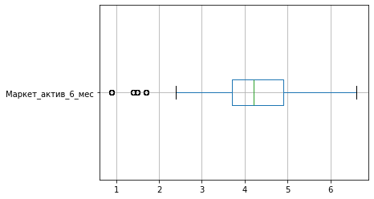
    


```python
field_st(market_file,'Маркет_актив_тек_мес')
```


<div>
<style scoped>
    .dataframe tbody tr th:only-of-type {
        vertical-align: middle;
    }

    .dataframe tbody tr th {
        vertical-align: top;
    }

    .dataframe thead th {
        text-align: right;
    }
</style>
<table border="1" class="dataframe">
  <thead>
    <tr style="text-align: right;">
      <th></th>
      <th>min</th>
      <th>max</th>
      <th>mean</th>
      <th>median</th>
      <th>q1</th>
      <th>q3</th>
    </tr>
  </thead>
  <tbody>
    <tr>
      <th>0</th>
      <td>3</td>
      <td>5</td>
      <td>4.011538</td>
      <td>4.0</td>
      <td>4.0</td>
      <td>4.0</td>
    </tr>
  </tbody>
</table>
</div>


    
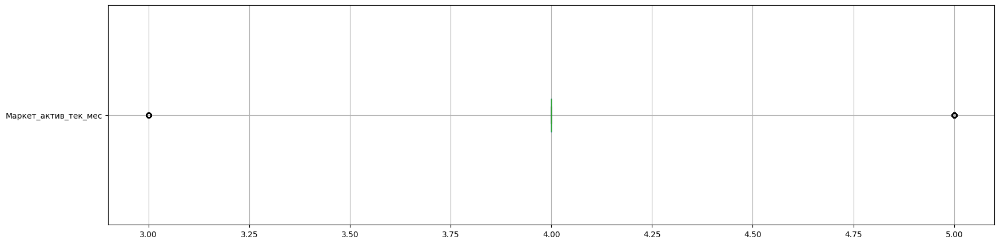
    


```python
field_st(market_file,'Длительность')
```


<div>
<style scoped>
    .dataframe tbody tr th:only-of-type {
        vertical-align: middle;
    }

    .dataframe tbody tr th {
        vertical-align: top;
    }

    .dataframe thead th {
        text-align: right;
    }
</style>
<table border="1" class="dataframe">
  <thead>
    <tr style="text-align: right;">
      <th></th>
      <th>min</th>
      <th>max</th>
      <th>mean</th>
      <th>median</th>
      <th>q1</th>
      <th>q3</th>
    </tr>
  </thead>
  <tbody>
    <tr>
      <th>0</th>
      <td>110</td>
      <td>1079</td>
      <td>601.898462</td>
      <td>606.0</td>
      <td>405.5</td>
      <td>806.0</td>
    </tr>
  </tbody>
</table>
</div>


    
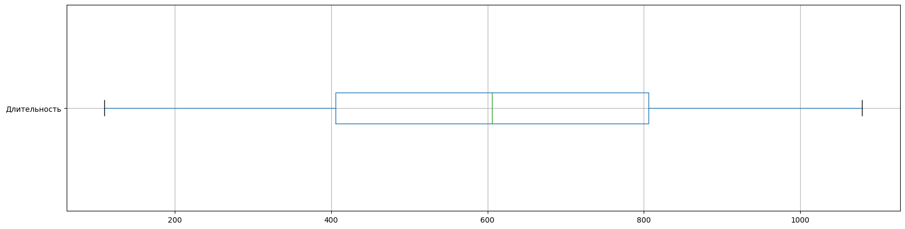
    


```python
field_st(market_file,'Акционные_покупки')
```


<div>
<style scoped>
    .dataframe tbody tr th:only-of-type {
        vertical-align: middle;
    }

    .dataframe tbody tr th {
        vertical-align: top;
    }

    .dataframe thead th {
        text-align: right;
    }
</style>
<table border="1" class="dataframe">
  <thead>
    <tr style="text-align: right;">
      <th></th>
      <th>min</th>
      <th>max</th>
      <th>mean</th>
      <th>median</th>
      <th>q1</th>
      <th>q3</th>
    </tr>
  </thead>
  <tbody>
    <tr>
      <th>0</th>
      <td>0.0</td>
      <td>0.99</td>
      <td>0.319808</td>
      <td>0.24</td>
      <td>0.17</td>
      <td>0.3</td>
    </tr>
  </tbody>
</table>
</div>


    
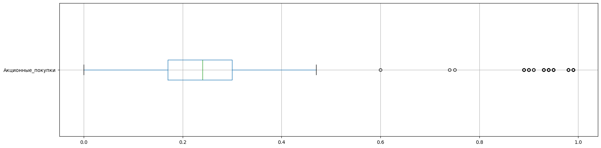
    


```python
field_st(market_file,'Средний_просмотр_категорий_за_визит')
```


<div>
<style scoped>
    .dataframe tbody tr th:only-of-type {
        vertical-align: middle;
    }

    .dataframe tbody tr th {
        vertical-align: top;
    }

    .dataframe thead th {
        text-align: right;
    }
</style>
<table border="1" class="dataframe">
  <thead>
    <tr style="text-align: right;">
      <th></th>
      <th>min</th>
      <th>max</th>
      <th>mean</th>
      <th>median</th>
      <th>q1</th>
      <th>q3</th>
    </tr>
  </thead>
  <tbody>
    <tr>
      <th>0</th>
      <td>1</td>
      <td>6</td>
      <td>3.27</td>
      <td>3.0</td>
      <td>2.0</td>
      <td>4.0</td>
    </tr>
  </tbody>
</table>
</div>


    
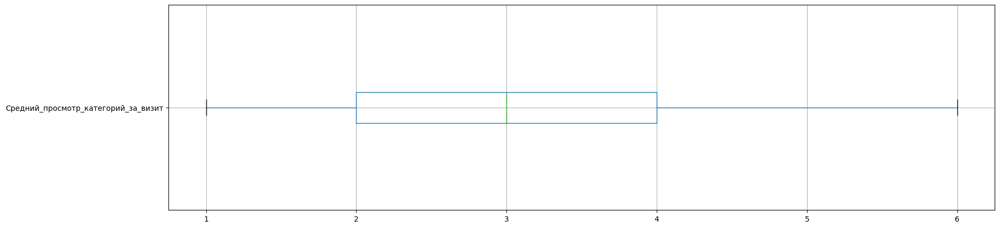
    


```python
field_st(market_file,'Неоплаченные_продукты_штук_квартал')
```


<div>
<style scoped>
    .dataframe tbody tr th:only-of-type {
        vertical-align: middle;
    }

    .dataframe tbody tr th {
        vertical-align: top;
    }

    .dataframe thead th {
        text-align: right;
    }
</style>
<table border="1" class="dataframe">
  <thead>
    <tr style="text-align: right;">
      <th></th>
      <th>min</th>
      <th>max</th>
      <th>mean</th>
      <th>median</th>
      <th>q1</th>
      <th>q3</th>
    </tr>
  </thead>
  <tbody>
    <tr>
      <th>0</th>
      <td>0</td>
      <td>10</td>
      <td>2.84</td>
      <td>3.0</td>
      <td>1.0</td>
      <td>4.0</td>
    </tr>
  </tbody>
</table>
</div>


    
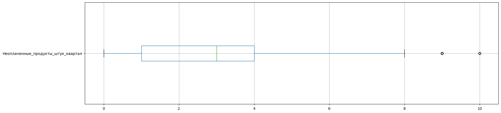
    


```python
field_st(market_file,'Ошибка_сервиса')
```


<div>
<style scoped>
    .dataframe tbody tr th:only-of-type {
        vertical-align: middle;
    }

    .dataframe tbody tr th {
        vertical-align: top;
    }

    .dataframe thead th {
        text-align: right;
    }
</style>
<table border="1" class="dataframe">
  <thead>
    <tr style="text-align: right;">
      <th></th>
      <th>min</th>
      <th>max</th>
      <th>mean</th>
      <th>median</th>
      <th>q1</th>
      <th>q3</th>
    </tr>
  </thead>
  <tbody>
    <tr>
      <th>0</th>
      <td>0</td>
      <td>9</td>
      <td>4.185385</td>
      <td>4.0</td>
      <td>3.0</td>
      <td>6.0</td>
    </tr>
  </tbody>
</table>
</div>


    
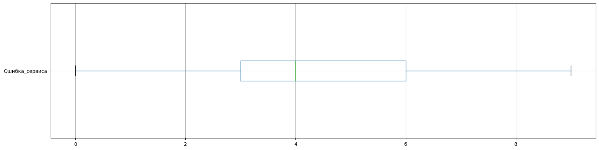
    


```python
field_st(market_file,'Страниц_за_визит')
```


<div>
<style scoped>
    .dataframe tbody tr th:only-of-type {
        vertical-align: middle;
    }

    .dataframe tbody tr th {
        vertical-align: top;
    }

    .dataframe thead th {
        text-align: right;
    }
</style>
<table border="1" class="dataframe">
  <thead>
    <tr style="text-align: right;">
      <th></th>
      <th>min</th>
      <th>max</th>
      <th>mean</th>
      <th>median</th>
      <th>q1</th>
      <th>q3</th>
    </tr>
  </thead>
  <tbody>
    <tr>
      <th>0</th>
      <td>1</td>
      <td>20</td>
      <td>8.176923</td>
      <td>8.0</td>
      <td>5.0</td>
      <td>11.0</td>
    </tr>
  </tbody>
</table>
</div>


    
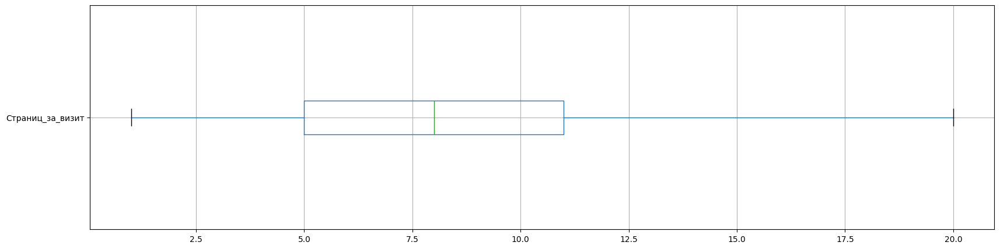
    


```python
field_st(market_money,'Выручка')
```


<div>
<style scoped>
    .dataframe tbody tr th:only-of-type {
        vertical-align: middle;
    }

    .dataframe tbody tr th {
        vertical-align: top;
    }

    .dataframe thead th {
        text-align: right;
    }
</style>
<table border="1" class="dataframe">
  <thead>
    <tr style="text-align: right;">
      <th></th>
      <th>min</th>
      <th>max</th>
      <th>mean</th>
      <th>median</th>
      <th>q1</th>
      <th>q3</th>
    </tr>
  </thead>
  <tbody>
    <tr>
      <th>0</th>
      <td>0.0</td>
      <td>106862.2</td>
      <td>5025.696051</td>
      <td>4957.5</td>
      <td>4590.15</td>
      <td>5363.0</td>
    </tr>
  </tbody>
</table>
</div>


    
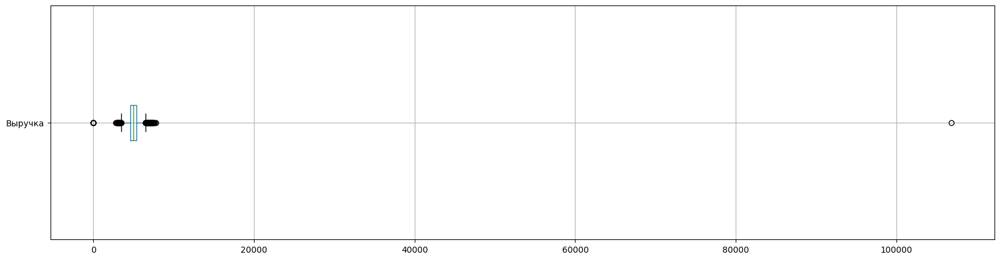
    


Есть явные выбросы.


```python
field_st(market_time,'минут')
```


<div>
<style scoped>
    .dataframe tbody tr th:only-of-type {
        vertical-align: middle;
    }

    .dataframe tbody tr th {
        vertical-align: top;
    }

    .dataframe thead th {
        text-align: right;
    }
</style>
<table border="1" class="dataframe">
  <thead>
    <tr style="text-align: right;">
      <th></th>
      <th>min</th>
      <th>max</th>
      <th>mean</th>
      <th>median</th>
      <th>q1</th>
      <th>q3</th>
    </tr>
  </thead>
  <tbody>
    <tr>
      <th>0</th>
      <td>4</td>
      <td>23</td>
      <td>13.336154</td>
      <td>13.0</td>
      <td>10.0</td>
      <td>16.0</td>
    </tr>
  </tbody>
</table>
</div>


    
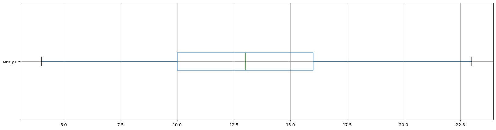
    


```python
field_st(money,'Прибыль')
```


<div>
<style scoped>
    .dataframe tbody tr th:only-of-type {
        vertical-align: middle;
    }

    .dataframe tbody tr th {
        vertical-align: top;
    }

    .dataframe thead th {
        text-align: right;
    }
</style>
<table border="1" class="dataframe">
  <thead>
    <tr style="text-align: right;">
      <th></th>
      <th>min</th>
      <th>max</th>
      <th>mean</th>
      <th>median</th>
      <th>q1</th>
      <th>q3</th>
    </tr>
  </thead>
  <tbody>
    <tr>
      <th>0</th>
      <td>0.86</td>
      <td>7.43</td>
      <td>3.996631</td>
      <td>4.045</td>
      <td>3.3</td>
      <td>4.67</td>
    </tr>
  </tbody>
</table>
</div>


    
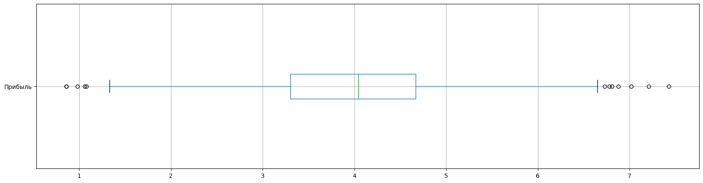
    


```python
display(market_money[market_money['Выручка'] > 100000])
```


<div>
<style scoped>
    .dataframe tbody tr th:only-of-type {
        vertical-align: middle;
    }

    .dataframe tbody tr th {
        vertical-align: top;
    }

    .dataframe thead th {
        text-align: right;
    }
</style>
<table border="1" class="dataframe">
  <thead>
    <tr style="text-align: right;">
      <th></th>
      <th>id</th>
      <th>Период</th>
      <th>Выручка</th>
    </tr>
  </thead>
  <tbody>
    <tr>
      <th>98</th>
      <td>215380</td>
      <td>текущий_месяц</td>
      <td>106862.2</td>
    </tr>
  </tbody>
</table>
</div>


```python
display(market_file[market_file['id'] == 215380])
print("\nВыручке для id 215380:")
display(market_money[market_money['id'] == 215380])
print("\nВремени, проведенное на сайте для id 215380:")
display(market_time[market_time['id'] == 215380])
print("\Прибыль для id 215380:")
display(money[money['id'] == 215380])

```


<div>
<style scoped>
    .dataframe tbody tr th:only-of-type {
        vertical-align: middle;
    }

    .dataframe tbody tr th {
        vertical-align: top;
    }

    .dataframe thead th {
        text-align: right;
    }
</style>
<table border="1" class="dataframe">
  <thead>
    <tr style="text-align: right;">
      <th></th>
      <th>id</th>
      <th>Покупательская активность</th>
      <th>Тип сервиса</th>
      <th>Разрешить сообщать</th>
      <th>Маркет_актив_6_мес</th>
      <th>Маркет_актив_тек_мес</th>
      <th>Длительность</th>
      <th>Акционные_покупки</th>
      <th>Популярная_категория</th>
      <th>Средний_просмотр_категорий_за_визит</th>
      <th>Неоплаченные_продукты_штук_квартал</th>
      <th>Ошибка_сервиса</th>
      <th>Страниц_за_визит</th>
    </tr>
  </thead>
  <tbody>
    <tr>
      <th>32</th>
      <td>215380</td>
      <td>Снизилась</td>
      <td>премиум</td>
      <td>нет</td>
      <td>1.7</td>
      <td>4</td>
      <td>637</td>
      <td>0.94</td>
      <td>Техника для красоты и здоровья</td>
      <td>3</td>
      <td>2</td>
      <td>4</td>
      <td>7</td>
    </tr>
  </tbody>
</table>
</div>


    
    Выручке для id 215380:


<div>
<style scoped>
    .dataframe tbody tr th:only-of-type {
        vertical-align: middle;
    }

    .dataframe tbody tr th {
        vertical-align: top;
    }

    .dataframe thead th {
        text-align: right;
    }
</style>
<table border="1" class="dataframe">
  <thead>
    <tr style="text-align: right;">
      <th></th>
      <th>id</th>
      <th>Период</th>
      <th>Выручка</th>
    </tr>
  </thead>
  <tbody>
    <tr>
      <th>96</th>
      <td>215380</td>
      <td>препредыдущий_месяц</td>
      <td>5051.0</td>
    </tr>
    <tr>
      <th>97</th>
      <td>215380</td>
      <td>предыдущий_месяц</td>
      <td>6077.0</td>
    </tr>
    <tr>
      <th>98</th>
      <td>215380</td>
      <td>текущий_месяц</td>
      <td>106862.2</td>
    </tr>
  </tbody>
</table>
</div>


    
    Времени, проведенное на сайте для id 215380:


<div>
<style scoped>
    .dataframe tbody tr th:only-of-type {
        vertical-align: middle;
    }

    .dataframe tbody tr th {
        vertical-align: top;
    }

    .dataframe thead th {
        text-align: right;
    }
</style>
<table border="1" class="dataframe">
  <thead>
    <tr style="text-align: right;">
      <th></th>
      <th>id</th>
      <th>Период</th>
      <th>минут</th>
    </tr>
  </thead>
  <tbody>
    <tr>
      <th>64</th>
      <td>215380</td>
      <td>предыдущий_месяц</td>
      <td>12</td>
    </tr>
    <tr>
      <th>65</th>
      <td>215380</td>
      <td>текущий_месяц</td>
      <td>14</td>
    </tr>
  </tbody>
</table>
</div>


    \Прибыль для id 215380:


<div>
<style scoped>
    .dataframe tbody tr th:only-of-type {
        vertical-align: middle;
    }

    .dataframe tbody tr th {
        vertical-align: top;
    }

    .dataframe thead th {
        text-align: right;
    }
</style>
<table border="1" class="dataframe">
  <thead>
    <tr style="text-align: right;">
      <th></th>
      <th>id</th>
      <th>Прибыль</th>
    </tr>
  </thead>
  <tbody>
    <tr>
      <th>32</th>
      <td>215380</td>
      <td>3.88</td>
    </tr>
  </tbody>
</table>
</div>


Покупательская активность клиента 215380 снизилась, но по общей выручке за текущий месяц, мы видим, что она аномально выросла. Т.к. клиент с аномальными данными только один, удаление его данных из всех датафреймов на наш анализ не повлияет.

<font color='blue'><b>Комментарий ревьюера : </b></font> ✔️\
<font color='green'>Действительно явный выброс.
Можно удалить, а можно и заполнить, например значением предыдущего месяца.</font>


```python
market_file = market_file[market_file['id'] != 215380]
market_money = market_money[market_money['id'] != 215380]
market_time = market_time[market_time['id'] != 215380]
money = money[money['id'] != 215380]
```


```python
no_revenue = market_money.query('Выручка == 0')['id'].unique().tolist()
no_revenue
```


    [215348, 215357, 215359]


```python
market_file, market_money, market_time, money = market_file[~market_file['id'].isin(no_revenue)],\
                                                market_money[~market_money['id'].isin(no_revenue)],\
                                                market_time[~market_time['id'].isin(no_revenue)],\
                                                money[~money['id'].isin(no_revenue)]
```


```python
column = 'Покупательская активность'
categories = ['Снизилась', 'Прежний уровень']
columns = [col for col in market_file.columns if col != 'id']
for col in columns:
    plt.figure(figsize=(14, 7))
    for category in categories:
      data = market_file[market_file[column] == category]
      plt.hist(data[col].dropna(), bins=15, alpha=0.5, label=category)

    plt.title(f'Гистограмма для {col}')
    plt.xlabel(col)
    plt.ylabel('Частота')
    plt.legend()
    plt.show()
    print(f'Таблица для {col}:')
    for category in categories:
        data = market_file[market_file[column] == category]
        print(f'\nКатегория: {category}')
        display(data[col].describe())

```


    
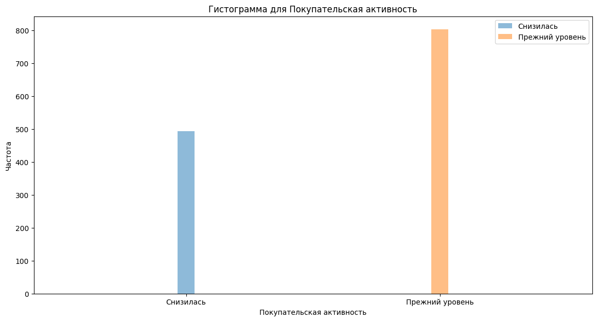
    


    Таблица для Покупательская активность:
    
    Категория: Снизилась


    count           494
    unique            1
    top       Снизилась
    freq            494
    Name: Покупательская активность, dtype: object


    
    Категория: Прежний уровень


    count                 802
    unique                  1
    top       Прежний уровень
    freq                  802
    Name: Покупательская активность, dtype: object


    
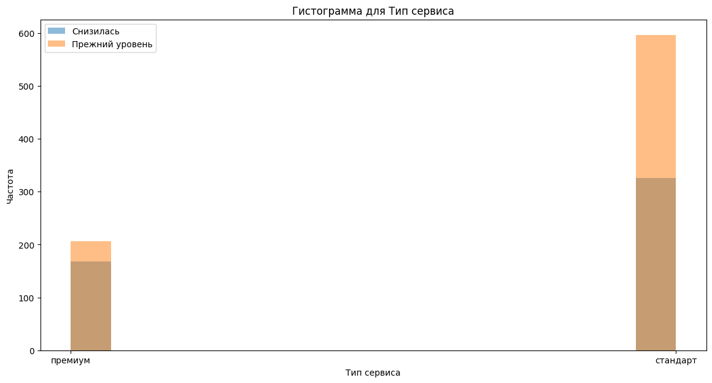
    


    Таблица для Тип сервиса:
    
    Категория: Снизилась


    count          494
    unique           2
    top       стандарт
    freq           326
    Name: Тип сервиса, dtype: object


    
    Категория: Прежний уровень


    count          802
    unique           2
    top       стандарт
    freq           596
    Name: Тип сервиса, dtype: object


    
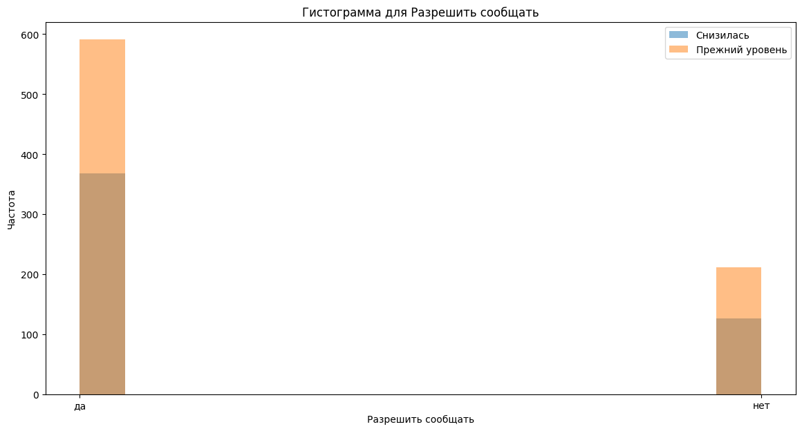
    


    Таблица для Разрешить сообщать:
    
    Категория: Снизилась


    count     494
    unique      2
    top        да
    freq      368
    Name: Разрешить сообщать, dtype: object


    
    Категория: Прежний уровень


    count     802
    unique      2
    top        да
    freq      591
    Name: Разрешить сообщать, dtype: object


    
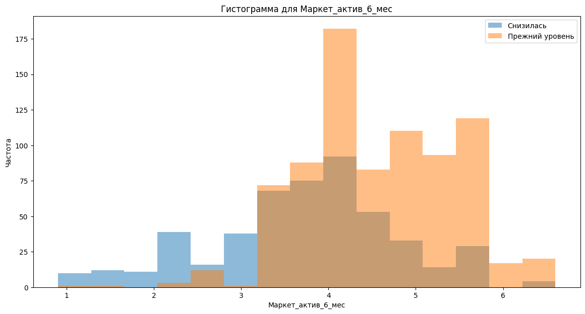
    


    Таблица для Маркет_актив_6_мес:
    
    Категория: Снизилась


    count    494.000000
    mean       3.747166
    std        1.052777
    min        0.900000
    25%        3.100000
    50%        3.900000
    75%        4.400000
    max        6.600000
    Name: Маркет_актив_6_мес, dtype: float64


    
    Категория: Прежний уровень


    count    802.000000
    mean       4.570075
    std        0.848618
    min        0.900000
    25%        4.000000
    50%        4.400000
    75%        5.275000
    max        6.600000
    Name: Маркет_актив_6_мес, dtype: float64


    
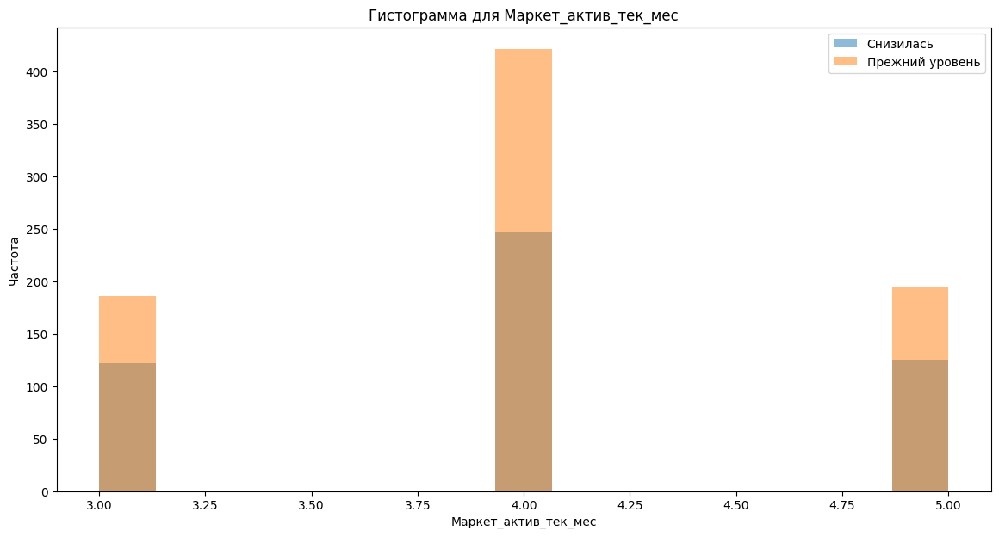
    


    Таблица для Маркет_актив_тек_мес:
    
    Категория: Снизилась


    count    494.000000
    mean       4.006073
    std        0.707797
    min        3.000000
    25%        4.000000
    50%        4.000000
    75%        5.000000
    max        5.000000
    Name: Маркет_актив_тек_мес, dtype: float64


    
    Категория: Прежний уровень


    count    802.000000
    mean       4.011222
    std        0.689586
    min        3.000000
    25%        4.000000
    50%        4.000000
    75%        4.000000
    max        5.000000
    Name: Маркет_актив_тек_мес, dtype: float64


    
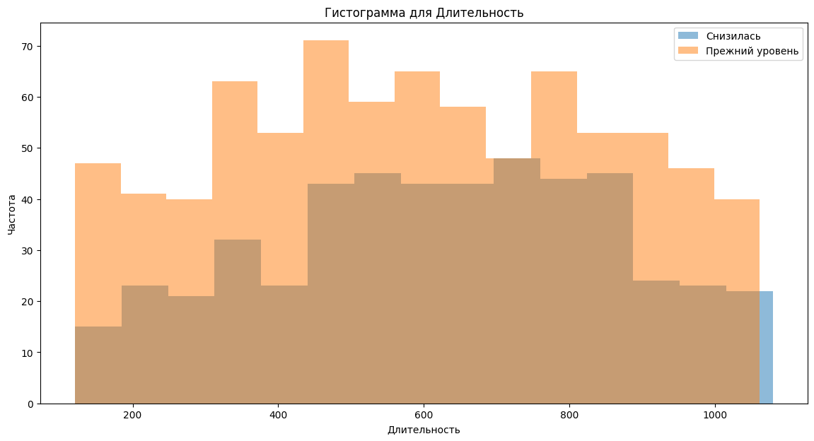
    


    Таблица для Длительность:
    
    Категория: Снизилась


    count     494.000000
    mean      622.834008
    std       237.817052
    min       121.000000
    25%       449.000000
    50%       636.500000
    75%       812.500000
    max      1079.000000
    Name: Длительность, dtype: float64


    
    Категория: Прежний уровень


    count     802.000000
    mean      590.730673
    std       255.330179
    min       121.000000
    25%       382.500000
    50%       590.000000
    75%       798.750000
    max      1061.000000
    Name: Длительность, dtype: float64


    
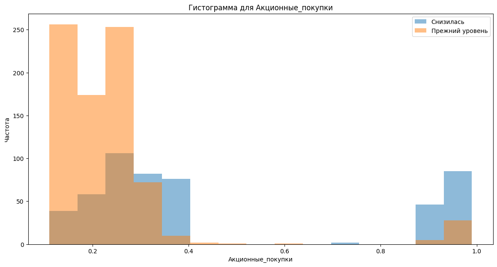
    


    Таблица для Акционные_покупки:
    
    Категория: Снизилась


    count    494.000000
    mean       0.452713
    std        0.304428
    min        0.110000
    25%        0.240000
    50%        0.310000
    75%        0.890000
    max        0.990000
    Name: Акционные_покупки, dtype: float64


    
    Категория: Прежний уровень


    count    802.000000
    mean       0.238367
    std        0.160599
    min        0.110000
    25%        0.150000
    50%        0.210000
    75%        0.260000
    max        0.990000
    Name: Акционные_покупки, dtype: float64


    
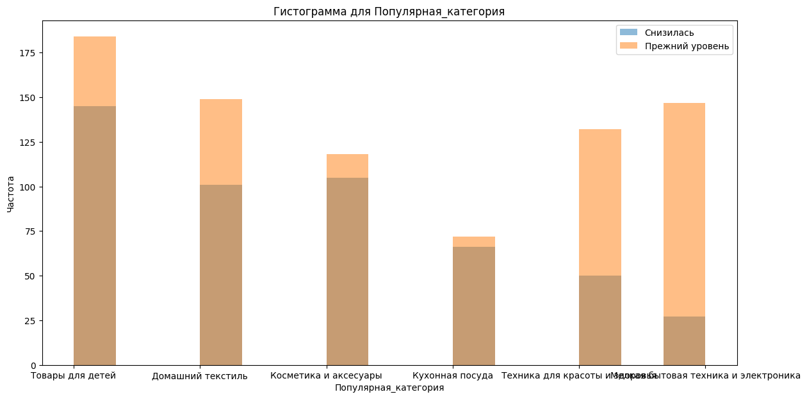
    


    Таблица для Популярная_категория:
    
    Категория: Снизилась


    count                  494
    unique                   6
    top       Товары для детей
    freq                   145
    Name: Популярная_категория, dtype: object


    
    Категория: Прежний уровень


    count                  802
    unique                   6
    top       Товары для детей
    freq                   184
    Name: Популярная_категория, dtype: object


    
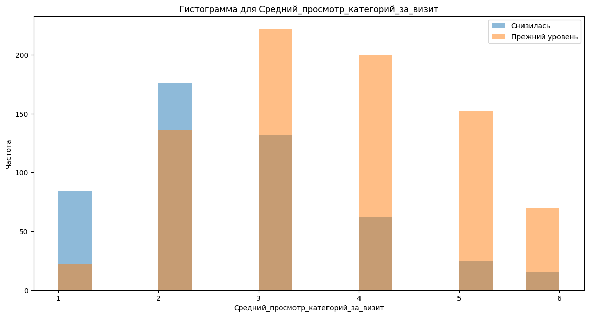
    


    Таблица для Средний_просмотр_категорий_за_визит:
    
    Категория: Снизилась


    count    494.000000
    mean       2.621457
    std        1.223678
    min        1.000000
    25%        2.000000
    50%        2.000000
    75%        3.000000
    max        6.000000
    Name: Средний_просмотр_категорий_за_визит, dtype: float64


    
    Категория: Прежний уровень


    count    802.000000
    mean       3.665835
    std        1.277112
    min        1.000000
    25%        3.000000
    50%        4.000000
    75%        5.000000
    max        6.000000
    Name: Средний_просмотр_категорий_за_визит, dtype: float64


    
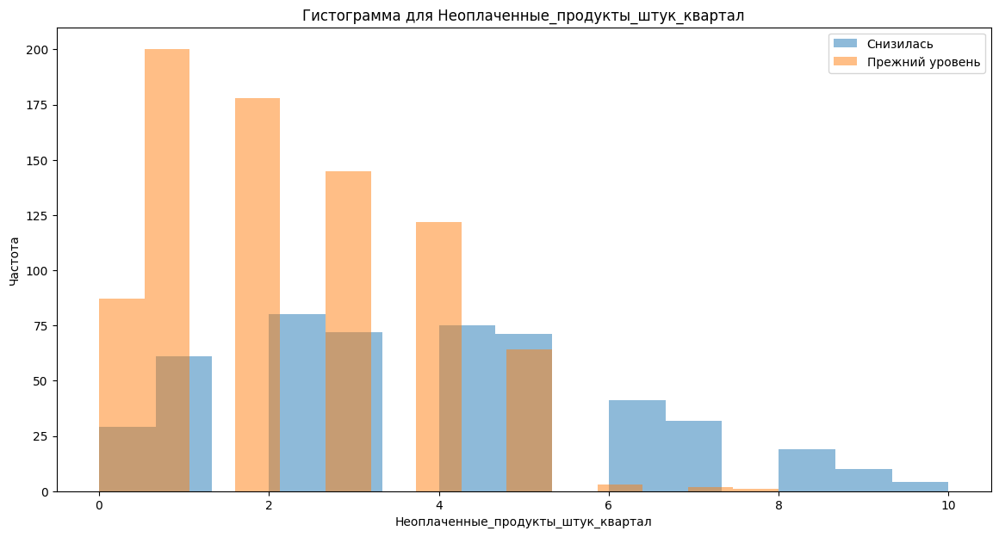
    


    Таблица для Неоплаченные_продукты_штук_квартал:
    
    Категория: Снизилась


    count    494.000000
    mean       3.732794
    std        2.292385
    min        0.000000
    25%        2.000000
    50%        4.000000
    75%        5.000000
    max       10.000000
    Name: Неоплаченные_продукты_штук_квартал, dtype: float64


    
    Категория: Прежний уровень


    count    802.000000
    mean       2.293017
    std        1.508255
    min        0.000000
    25%        1.000000
    50%        2.000000
    75%        3.000000
    max        8.000000
    Name: Неоплаченные_продукты_штук_квартал, dtype: float64


    
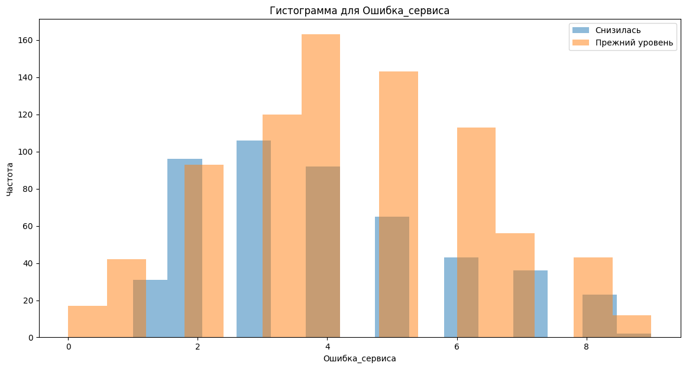
    


    Таблица для Ошибка_сервиса:
    
    Категория: Снизилась


    count    494.000000
    mean       3.939271
    std        1.882005
    min        1.000000
    25%        2.000000
    50%        4.000000
    75%        5.000000
    max        9.000000
    Name: Ошибка_сервиса, dtype: float64


    
    Категория: Прежний уровень


    count    802.000000
    mean       4.335411
    std        1.979538
    min        0.000000
    25%        3.000000
    50%        4.000000
    75%        6.000000
    max        9.000000
    Name: Ошибка_сервиса, dtype: float64


    
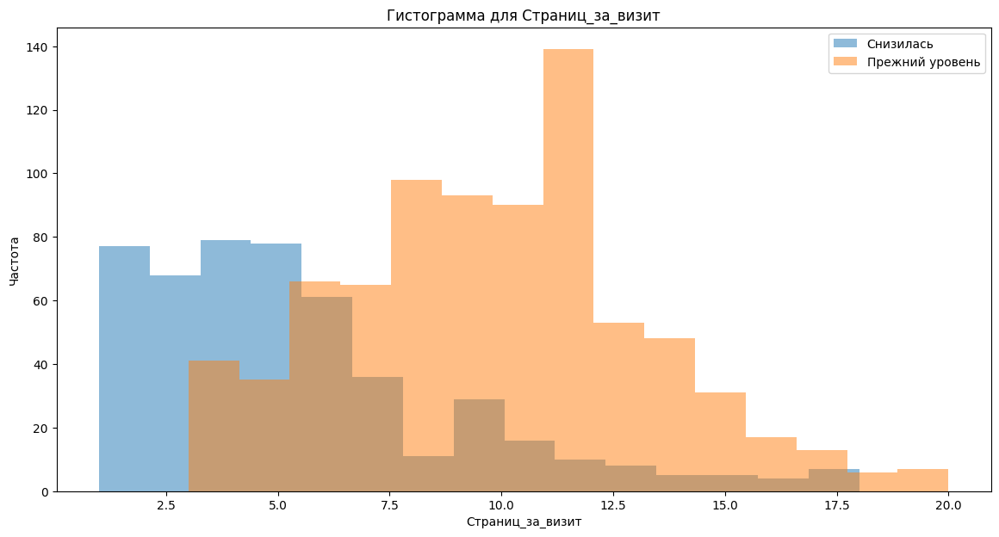
    


    Таблица для Страниц_за_визит:
    
    Категория: Снизилась


    count    494.000000
    mean       5.574899
    std        3.463729
    min        1.000000
    25%        3.000000
    50%        5.000000
    75%        7.000000
    max       18.000000
    Name: Страниц_за_визит, dtype: float64


    
    Категория: Прежний уровень


    count    802.000000
    mean       9.796758
    std        3.376846
    min        3.000000
    25%        7.000000
    50%       10.000000
    75%       12.000000
    max       20.000000
    Name: Страниц_за_визит, dtype: float64


Выводы:

Всего нам была преотсавлена информация по 1300 клиентам. Данные по трем клиентам мы брали, тк они не проявляли активнсти хотя бы в одном из последних трех месяцев.  

Покупательская активность снизилась у 494 клиентов, на прежнем уровене активность осталась у 802 клиентов.  

В большинстве случаев клиенты предпочитают стандартный тип сервиса и, также, большинство дало свое согласие на отправку писем от компании.

Активнсть за 6 месяцев снизилась больше у людей со стандартным типом подписки.  

Акционные покупки больше преобретают люди, чья активность снизилось, они, такжеб имеют большее количество неоплаченных товаров.

С ошибками сервиса чаще сталкиваются люди, чья активность осталась на прежнем уровне и они же просматривают больше страниц за визит.

Самая популярная категория товаров - товары для детей, наименее популярная - кухонная посуда.

Чаще всего за визит просматривается 3 категории, реже всего 6.


**Шаг 4. Объединение таблиц**


```python
display(market_file.shape)
display(market_money.shape)
display(market_time.shape)
display(money.shape)
```


    (1296, 13)


    (3888, 3)


    (2592, 3)


    (1296, 2)


```python
display(market_file['id'].nunique())
display(market_money['id'].nunique())
display(market_time['id'].nunique())
display(money['id'].nunique())
```


    1296


    1296


    1296


    1296


Количество уникальных id в трёх таблицах одинаковое.


```python
m_money_pivot = market_money.pivot_table(index='id', values='Выручка',columns='Период')\
                                        .add_prefix('Выручка_')
m_money_pivot.index.name = None
m_money_pivot = m_money_pivot.rename_axis(None, axis=1)
m_money_col = m_money_pivot.columns.tolist()
m_money_col = ['Выручка_препредыдущий_месяц',
              'Выручка_предыдущий_месяц',
              'Выручка_текущий_месяц']
m_money_pivot = m_money_pivot[m_money_col]
m_money_pivot.head()
```


<div>
<style scoped>
    .dataframe tbody tr th:only-of-type {
        vertical-align: middle;
    }

    .dataframe tbody tr th {
        vertical-align: top;
    }

    .dataframe thead th {
        text-align: right;
    }
</style>
<table border="1" class="dataframe">
  <thead>
    <tr style="text-align: right;">
      <th></th>
      <th>Выручка_препредыдущий_месяц</th>
      <th>Выручка_предыдущий_месяц</th>
      <th>Выручка_текущий_месяц</th>
    </tr>
  </thead>
  <tbody>
    <tr>
      <th>215349</th>
      <td>4472.0</td>
      <td>5216.0</td>
      <td>4971.6</td>
    </tr>
    <tr>
      <th>215350</th>
      <td>4826.0</td>
      <td>5457.5</td>
      <td>5058.4</td>
    </tr>
    <tr>
      <th>215351</th>
      <td>4793.0</td>
      <td>6158.0</td>
      <td>6610.4</td>
    </tr>
    <tr>
      <th>215352</th>
      <td>4594.0</td>
      <td>5807.5</td>
      <td>5872.5</td>
    </tr>
    <tr>
      <th>215353</th>
      <td>5124.0</td>
      <td>4738.5</td>
      <td>5388.5</td>
    </tr>
  </tbody>
</table>
</div>


```python
m_time_pivot = market_time.pivot_table(index='id', values='минут',\
                                            columns='Период').add_prefix('Минут_')
m_time_pivot = m_time_pivot.rename_axis(None, axis=1)
m_time_pivot.head()
```


<div>
<style scoped>
    .dataframe tbody tr th:only-of-type {
        vertical-align: middle;
    }

    .dataframe tbody tr th {
        vertical-align: top;
    }

    .dataframe thead th {
        text-align: right;
    }
</style>
<table border="1" class="dataframe">
  <thead>
    <tr style="text-align: right;">
      <th></th>
      <th>Минут_предыдущий_месяц</th>
      <th>Минут_текущий_месяц</th>
    </tr>
    <tr>
      <th>id</th>
      <th></th>
      <th></th>
    </tr>
  </thead>
  <tbody>
    <tr>
      <th>215349</th>
      <td>12</td>
      <td>10</td>
    </tr>
    <tr>
      <th>215350</th>
      <td>8</td>
      <td>13</td>
    </tr>
    <tr>
      <th>215351</th>
      <td>11</td>
      <td>13</td>
    </tr>
    <tr>
      <th>215352</th>
      <td>8</td>
      <td>11</td>
    </tr>
    <tr>
      <th>215353</th>
      <td>10</td>
      <td>10</td>
    </tr>
  </tbody>
</table>
</div>


```python
df_1 = market_file.join(m_time_pivot).join(m_money_pivot)
df_1.head()
```


<div>
<style scoped>
    .dataframe tbody tr th:only-of-type {
        vertical-align: middle;
    }

    .dataframe tbody tr th {
        vertical-align: top;
    }

    .dataframe thead th {
        text-align: right;
    }
</style>
<table border="1" class="dataframe">
  <thead>
    <tr style="text-align: right;">
      <th></th>
      <th>Покупательская активность</th>
      <th>Тип сервиса</th>
      <th>Разрешить сообщать</th>
      <th>Маркет_актив_6_мес</th>
      <th>Маркет_актив_тек_мес</th>
      <th>Длительность</th>
      <th>Акционные_покупки</th>
      <th>Популярная_категория</th>
      <th>Средний_просмотр_категорий_за_визит</th>
      <th>Неоплаченные_продукты_штук_квартал</th>
      <th>Ошибка_сервиса</th>
      <th>Страниц_за_визит</th>
      <th>Минут_предыдущий_месяц</th>
      <th>Минут_текущий_месяц</th>
      <th>Выручка_препредыдущий_месяц</th>
      <th>Выручка_предыдущий_месяц</th>
      <th>Выручка_текущий_месяц</th>
    </tr>
    <tr>
      <th>id</th>
      <th></th>
      <th></th>
      <th></th>
      <th></th>
      <th></th>
      <th></th>
      <th></th>
      <th></th>
      <th></th>
      <th></th>
      <th></th>
      <th></th>
      <th></th>
      <th></th>
      <th></th>
      <th></th>
      <th></th>
    </tr>
  </thead>
  <tbody>
    <tr>
      <th>215349</th>
      <td>Снизилась</td>
      <td>премиум</td>
      <td>да</td>
      <td>4.4</td>
      <td>4</td>
      <td>819</td>
      <td>0.75</td>
      <td>Товары для детей</td>
      <td>4</td>
      <td>4</td>
      <td>2</td>
      <td>5</td>
      <td>12</td>
      <td>10</td>
      <td>4472.0</td>
      <td>5216.0</td>
      <td>4971.6</td>
    </tr>
    <tr>
      <th>215350</th>
      <td>Снизилась</td>
      <td>стандарт</td>
      <td>нет</td>
      <td>4.9</td>
      <td>3</td>
      <td>539</td>
      <td>0.14</td>
      <td>Домашний текстиль</td>
      <td>5</td>
      <td>2</td>
      <td>1</td>
      <td>5</td>
      <td>8</td>
      <td>13</td>
      <td>4826.0</td>
      <td>5457.5</td>
      <td>5058.4</td>
    </tr>
    <tr>
      <th>215351</th>
      <td>Снизилась</td>
      <td>стандарт</td>
      <td>да</td>
      <td>3.2</td>
      <td>5</td>
      <td>896</td>
      <td>0.99</td>
      <td>Товары для детей</td>
      <td>5</td>
      <td>0</td>
      <td>6</td>
      <td>4</td>
      <td>11</td>
      <td>13</td>
      <td>4793.0</td>
      <td>6158.0</td>
      <td>6610.4</td>
    </tr>
    <tr>
      <th>215352</th>
      <td>Снизилась</td>
      <td>стандарт</td>
      <td>нет</td>
      <td>5.1</td>
      <td>3</td>
      <td>1064</td>
      <td>0.94</td>
      <td>Товары для детей</td>
      <td>3</td>
      <td>2</td>
      <td>3</td>
      <td>2</td>
      <td>8</td>
      <td>11</td>
      <td>4594.0</td>
      <td>5807.5</td>
      <td>5872.5</td>
    </tr>
    <tr>
      <th>215353</th>
      <td>Снизилась</td>
      <td>стандарт</td>
      <td>да</td>
      <td>3.3</td>
      <td>4</td>
      <td>762</td>
      <td>0.26</td>
      <td>Домашний текстиль</td>
      <td>4</td>
      <td>1</td>
      <td>1</td>
      <td>4</td>
      <td>10</td>
      <td>10</td>
      <td>5124.0</td>
      <td>4738.5</td>
      <td>5388.5</td>
    </tr>
  </tbody>
</table>
</div>


```python
display(df_1.isnull().sum())
display(df_1.duplicated().sum())
df_1.info()
```


    Покупательская активность              0
    Тип сервиса                            0
    Разрешить сообщать                     0
    Маркет_актив_6_мес                     0
    Маркет_актив_тек_мес                   0
    Длительность                           0
    Акционные_покупки                      0
    Популярная_категория                   0
    Средний_просмотр_категорий_за_визит    0
    Неоплаченные_продукты_штук_квартал     0
    Ошибка_сервиса                         0
    Страниц_за_визит                       0
    Минут_предыдущий_месяц                 0
    Минут_текущий_месяц                    0
    Выручка_препредыдущий_месяц            0
    Выручка_предыдущий_месяц               0
    Выручка_текущий_месяц                  0
    dtype: int64


    11


    <class 'pandas.core.frame.DataFrame'>
    Int64Index: 1296 entries, 215349 to 216647
    Data columns (total 17 columns):
     #   Column                               Non-Null Count  Dtype  
    ---  ------                               --------------  -----  
     0   Покупательская активность            1296 non-null   object 
     1   Тип сервиса                          1296 non-null   object 
     2   Разрешить сообщать                   1296 non-null   object 
     3   Маркет_актив_6_мес                   1296 non-null   float64
     4   Маркет_актив_тек_мес                 1296 non-null   int64  
     5   Длительность                         1296 non-null   int64  
     6   Акционные_покупки                    1296 non-null   float64
     7   Популярная_категория                 1296 non-null   object 
     8   Средний_просмотр_категорий_за_визит  1296 non-null   int64  
     9   Неоплаченные_продукты_штук_квартал   1296 non-null   int64  
     10  Ошибка_сервиса                       1296 non-null   int64  
     11  Страниц_за_визит                     1296 non-null   int64  
     12  Минут_предыдущий_месяц               1296 non-null   int64  
     13  Минут_текущий_месяц                  1296 non-null   int64  
     14  Выручка_препредыдущий_месяц          1296 non-null   float64
     15  Выручка_предыдущий_месяц             1296 non-null   float64
     16  Выручка_текущий_месяц                1296 non-null   float64
    dtypes: float64(5), int64(8), object(4)
    memory usage: 214.5+ KB


```python
df_1['Акционные_покупки'] = df_1['Акционные_покупки'].apply(lambda x: 'редко' if x < 0.7 else 'часто')
```

Вывод

Три датасета объеденены в один с добавлением отдельного столбца для каждого периода.  
Количественные данные в признаке Акционные товары решили заменить на категориальные. С порогом 0.7.   


<font color='blue'><b>Комментарий ревьюера : </b></font> ✔️\
<font color='green'> 👍</font>

**Шаг 5. Корреляционный анализ**

Так как корреляция Пирсона измеряет степень и направление линейных корреляций между переменными, а у нас зависимости между признаками нелинейные, нам подойдет корреляция Фи.


```python
phik_matrix = df_1.phik_matrix()
plt.figure(figsize=(16, 9))
sns.heatmap(phik_matrix, annot=True, fmt=".2f")
plt.title("Матрица корреляции Фи")
plt.show()
```

    interval columns not set, guessing: ['Маркет_актив_6_мес', 'Маркет_актив_тек_мес', 'Длительность', 'Средний_просмотр_категорий_за_визит', 'Неоплаченные_продукты_штук_квартал', 'Ошибка_сервиса', 'Страниц_за_визит', 'Минут_предыдущий_месяц', 'Минут_текущий_месяц', 'Выручка_препредыдущий_месяц', 'Выручка_предыдущий_месяц', 'Выручка_текущий_месяц']


    
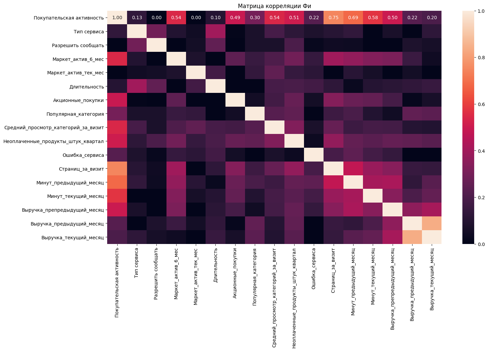
    


Вывод   

Сильную положительную корреляцию с покупательской активностью имеют признаки
Страниц за визит, Средний просмотр категорий за визити Маркет актив 6 мес.

Такие признаки как Тип сервиса, Разрешить сообщать, Маркет актив тек мес и Ошибка сервиса имеют низкую либо нулевую корреляцию с покупательской активностью.

Но так как корреляция не гарантирует причинно-следственную связь важно провести дополнительный анализ взаимосвязи признаков.  

Мультиколлинеарности не наблюдается.

<font color='blue'><b>Комментарий ревьюера : </b></font> ✔️\
<font color='green'> 👍</font>

**Шаг 6. Использование пайплайнов**


```python
df_1['Покупательская активность'] = df_1['Покупательская активность'].replace({'Снизилась': 1, 'Прежний уровень': 0})

```


```python
RANDOM_STATE = 42
TEST_SIZE = 0.25

X = df_1.drop('Покупательская активность', axis=1)
y = df_1['Покупательская активность']

```


```python
X_train, X_test, y_train, y_test = train_test_split(
    X,
    y,
    test_size=TEST_SIZE,
    random_state=RANDOM_STATE,
    stratify = df_1['Покупательская активность']
)
```


```python
label_encoder = LabelEncoder()

y_train = label_encoder.fit_transform(y_train)
y_test = label_encoder.transform(y_test)
```

<font color='blue'><b>Комментарий ревьюера: </b></font> ⚠️\
<font color='darkorange'> Мы уже закодировали таргет выше ([51]), но Энкодером это делать техничней.</font>


```python
num_columns = X_train.select_dtypes(include=np.number).columns.to_list()
```


```python
ohe_columns = ['Разрешить сообщать','Популярная_категория']
```


```python
ord_columns = ['Тип сервиса', 'Акционные_покупки']
```

<font color='blue'><b>Комментарий ревьюера : </b></font> ✔️\
<font color='green'> 👍</font>


```python
ohe_pipe = Pipeline(
    [
        (
            'simpleImputer_ohe',
            SimpleImputer(missing_values=np.nan, strategy='most_frequent')
        ),
        (
            'ohe',
            OneHotEncoder(drop='first', handle_unknown='ignore', sparse_output=False)
        )
    ]
)
```


```python
import sklearn
sklearn.__version__
```


    '1.4.2'


```python
ord_pipe = Pipeline(
    [
        (
            'simpleImputer_before_ord',
            SimpleImputer(missing_values=np.nan, strategy='most_frequent')
        ),
        (
            'ord',
            OrdinalEncoder(
                categories=[
                    ['стандарт', 'премиум'],
                    ['редко', 'часто'],
                    ],
                handle_unknown='use_encoded_value',
                unknown_value=np.nan
            )
        ),
        (
            'simpleImputer_after_ord',
            SimpleImputer(missing_values=np.nan, strategy='most_frequent')
        )
    ]
)
```


```python
data_preprocessor = ColumnTransformer(
    [('ohe', ohe_pipe, ohe_columns),
     ('ord', ord_pipe, ord_columns),
     ('num', MinMaxScaler(), num_columns)
    ],
    remainder='passthrough'
)
```


```python
pipe_final = Pipeline([
    ('preprocessor', data_preprocessor),
    ('models', DecisionTreeClassifier(random_state=RANDOM_STATE))
])
```


```python
param_grid = [
        {
        'models': [DecisionTreeClassifier(random_state=RANDOM_STATE)],
        'models__max_depth': range(2, 20),
        'models__max_features': range(2, 20),
        'preprocessor__num': [StandardScaler(), MinMaxScaler(), 'passthrough']
    },

    {
        'models': [KNeighborsClassifier()],
        'models__n_neighbors': range(2, 20),
        'preprocessor__num': [StandardScaler(), MinMaxScaler(), 'passthrough']
    },

    {
        'models': [LogisticRegression(
            random_state=RANDOM_STATE,
            solver='liblinear',
            penalty='l1'
        )],
        'models__C': range(1, 20),
        'preprocessor__num': [StandardScaler(), MinMaxScaler(), 'passthrough']
    },

    {
        'models': [SVC(
            random_state=RANDOM_STATE, probability=True
        )],
        'models__C': range(1, 20),
        'preprocessor__num': [StandardScaler(), MinMaxScaler(), 'passthrough']
    }
]
```


```python
grid = GridSearchCV(
    pipe_final,
    param_grid,
    cv=6,
    scoring='roc_auc',

    n_jobs=-1
)
```


```python
grid.fit(X_train, y_train)
y_train_pred = grid.best_estimator_.fit(X_train, y_train).predict(X_train)
print('Лучшая модель и её параметры:\n\n', grid.best_estimator_)
print ('Метрика лучшей модели на тренировочной выборке:', grid.best_score_)
y_train_pred_prob = grid.best_estimator_.predict_proba(X_train)[:,1]
print(f'Метрика ROC-AUC на тренировочной выборке: {roc_auc_score(y_train, y_train_pred_prob)}')
roc_auc = roc_auc_score(y_train, y_train_pred_prob)

print(f'Метрика ROC-AUC для класса 1 на тренировочной выборке: {roc_auc:.2f}')
```

    Лучшая модель и её параметры:
    
     Pipeline(steps=[('preprocessor',
                     ColumnTransformer(remainder='passthrough',
                                       transformers=[('ohe',
                                                      Pipeline(steps=[('simpleImputer_ohe',
                                                                       SimpleImputer(strategy='most_frequent')),
                                                                      ('ohe',
                                                                       OneHotEncoder(drop='first',
                                                                                     handle_unknown='ignore',
                                                                                     sparse_output=False))]),
                                                      ['Разрешить сообщать',
                                                       'Популярная_категория']),
                                                     ('ord',
                                                      Pipeline(steps=[('simpleImputer_before_ord...
                                                      ['Маркет_актив_6_мес',
                                                       'Маркет_актив_тек_мес',
                                                       'Длительность',
                                                       'Средний_просмотр_категорий_за_визит',
                                                       'Неоплаченные_продукты_штук_квартал',
                                                       'Ошибка_сервиса',
                                                       'Страниц_за_визит',
                                                       'Минут_предыдущий_месяц',
                                                       'Минут_текущий_месяц',
                                                       'Выручка_препредыдущий_месяц',
                                                       'Выручка_предыдущий_месяц',
                                                       'Выручка_текущий_месяц'])])),
                    ('models', SVC(C=1, probability=True, random_state=42))])
    Метрика лучшей модели на тренировочной выборке: 0.9070925768743952
    Метрика ROC-AUC на тренировочной выборке: 0.9681348695570275
    Метрика ROC-AUC для класса 1 на тренировочной выборке: 0.97


Мы нашли лучшую модель для обучения. Ей оказалась SVC с параметрами C=1 и random_state=42. Категориальные данные были обработаны с помощью OneHotEncoder, числовые  с помощью SimpleImputer.

Метрика лучшей модели на тренировочной выборке равнв 0.907. Это очень хороший результат, который показывает, что модель хорошо обучилась на тренировочных данных и уловила большинство закономнерностей между признаками.

Метрика ROC-AUC на тестовой выборке равна 0.89.

Метрика ROC-AUC для класса 1 на тестовой выборке равна 0.91.  Данная метрика хорошо оценивает вероятности классов.

Я считаю, что модель показала очень хорошие результаты и может быть использована в дальнейшем для предсказания покупательской активности.


```python
X_train_2 = pipe_final.named_steps['preprocessor'].fit_transform(X_train)
```


```python
explainer = shap.KernelExplainer(grid.best_estimator_.named_steps['models'].predict_proba, X_train_2)
```

    Using 972 background data samples could cause slower run times. Consider using shap.sample(data, K) or shap.kmeans(data, K) to summarize the background as K samples.


```python
X_test_2 = pipe_final.named_steps['preprocessor'].transform(X_test)
```


```python
feature_names = pipe_final.named_steps['preprocessor'].get_feature_names_out()
```


```python
X_test_2 = pd.DataFrame(X_test_2, columns=feature_names)
```


```python
X_test_2.shape
```


    (324, 20)


```python
X_test_2 = pd.DataFrame(shap.sample(X_test_2, 10), columns=feature_names)
```

<font color='green'><b> Вопрос к ревьюеру.</b></font> Павел, помоги, пожалуйста, понять, почему у меня оценка важности признаков занимает по 6 часов?! (это у меня ноут такой древний?:( ) и можно их как-то сохранить, чтобы ячейки не запускались каждый раз при выполнении кода? спасибо

<font color='blue'><b>Комментарий ревьюера 2: </b></font> \
<font color='blue'> Расчёт значения Шепли довольно ресурсоёмкий процесс. Но нам не обязательно просчитывать все данные. Однако понять сколько данных будет достаточно - зависит от многих факторов. Основные: количество признаков (рамерность), сложность модели.\
Можно начать с небольшой подвыборки и увеличивать ее размер до тех пор, пока результаты не стабилизируются или вычисленная оценка не будет удовлетворять требуемому уровню точности для конкретного случая.\
У библиотеки `shap` есть некоторые инструменты для уменьшения вычислительной сложности, Например Top-K Shape, а также сэмплеры `shap.sample(data,K) и shap.kmeans(data,K)`. </font>


```python
X_sample = shap.sample(X_test_2,100)
```


```python
shap_values = explainer(X_sample)
```


      0%|          | 0/10 [00:00<?, ?it/s]


```python
shap.plots.bar(shap_values[:,:,1])
shap.plots.beeswarm(shap_values[:,:,1])
```


    
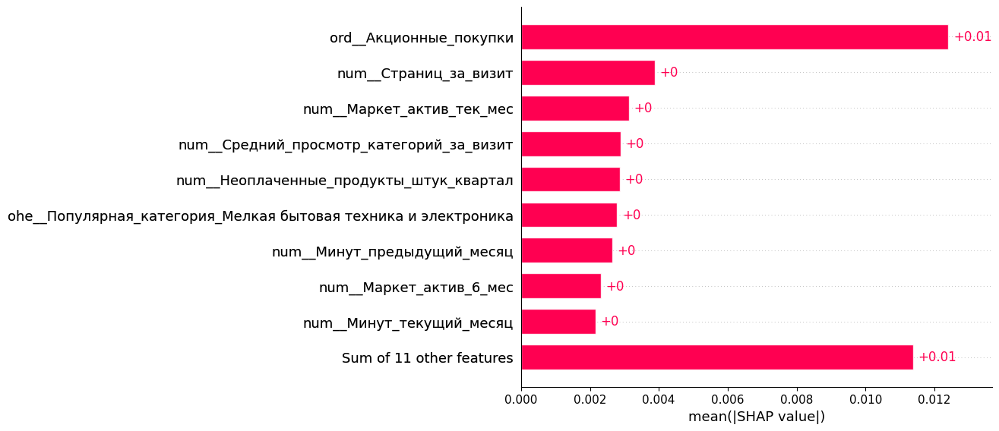
    


    
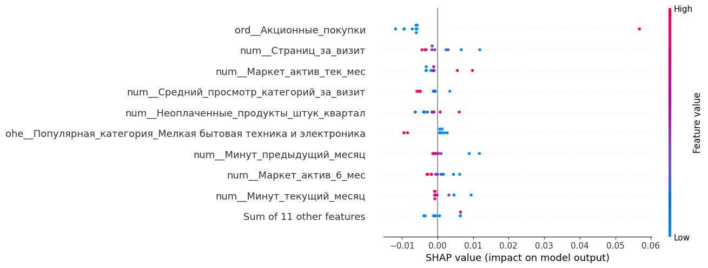
    


Вывод  

1. Признаки с отрицательными значениями SHAP влияют на сохранение покупательской активности. К ним относятся:
*   "num_минут_предыдущий_месяц"
*   "num_Страницы_за_визит"
*   "num_Средний_просмотр_категории_за_визит"
*   "num_Маркет актив 6 мес"
*   "num_выручка препредыдущий месяц"
Чем больше показатель вышеперечисленных признаков, тем меньше шансов, что у клиента упадет покупательская активнсть.

2. Признаки с положительныит значениями SHAP влияют на падение покупательской активности. К ним относятся:
*   "num_Акционные покупки"
*   "num_Неоплаченые продукты штука квартал"
Чем больше показатель вышеперечисленных признаков, тем больше шансов, что у клиента упадет покупательская активнсть.


**Шаг 8. Сегментация покупателей**

Мне кажется, что интереснее всего для бизнеса рассмотреть категорию клиентов, которая на данные момент дает много прибыли, но есть вероятность, что их активность снизится.


```python
target = df_1.drop(['Покупательская активность'], axis=1)
target.head()
```


<div>
<style scoped>
    .dataframe tbody tr th:only-of-type {
        vertical-align: middle;
    }

    .dataframe tbody tr th {
        vertical-align: top;
    }

    .dataframe thead th {
        text-align: right;
    }
</style>
<table border="1" class="dataframe">
  <thead>
    <tr style="text-align: right;">
      <th></th>
      <th>Тип сервиса</th>
      <th>Разрешить сообщать</th>
      <th>Маркет_актив_6_мес</th>
      <th>Маркет_актив_тек_мес</th>
      <th>Длительность</th>
      <th>Акционные_покупки</th>
      <th>Популярная_категория</th>
      <th>Средний_просмотр_категорий_за_визит</th>
      <th>Неоплаченные_продукты_штук_квартал</th>
      <th>Ошибка_сервиса</th>
      <th>Страниц_за_визит</th>
      <th>Минут_предыдущий_месяц</th>
      <th>Минут_текущий_месяц</th>
      <th>Выручка_препредыдущий_месяц</th>
      <th>Выручка_предыдущий_месяц</th>
      <th>Выручка_текущий_месяц</th>
    </tr>
    <tr>
      <th>id</th>
      <th></th>
      <th></th>
      <th></th>
      <th></th>
      <th></th>
      <th></th>
      <th></th>
      <th></th>
      <th></th>
      <th></th>
      <th></th>
      <th></th>
      <th></th>
      <th></th>
      <th></th>
      <th></th>
    </tr>
  </thead>
  <tbody>
    <tr>
      <th>215349</th>
      <td>премиум</td>
      <td>да</td>
      <td>4.4</td>
      <td>4</td>
      <td>819</td>
      <td>часто</td>
      <td>Товары для детей</td>
      <td>4</td>
      <td>4</td>
      <td>2</td>
      <td>5</td>
      <td>12</td>
      <td>10</td>
      <td>4472.0</td>
      <td>5216.0</td>
      <td>4971.6</td>
    </tr>
    <tr>
      <th>215350</th>
      <td>стандарт</td>
      <td>нет</td>
      <td>4.9</td>
      <td>3</td>
      <td>539</td>
      <td>редко</td>
      <td>Домашний текстиль</td>
      <td>5</td>
      <td>2</td>
      <td>1</td>
      <td>5</td>
      <td>8</td>
      <td>13</td>
      <td>4826.0</td>
      <td>5457.5</td>
      <td>5058.4</td>
    </tr>
    <tr>
      <th>215351</th>
      <td>стандарт</td>
      <td>да</td>
      <td>3.2</td>
      <td>5</td>
      <td>896</td>
      <td>часто</td>
      <td>Товары для детей</td>
      <td>5</td>
      <td>0</td>
      <td>6</td>
      <td>4</td>
      <td>11</td>
      <td>13</td>
      <td>4793.0</td>
      <td>6158.0</td>
      <td>6610.4</td>
    </tr>
    <tr>
      <th>215352</th>
      <td>стандарт</td>
      <td>нет</td>
      <td>5.1</td>
      <td>3</td>
      <td>1064</td>
      <td>часто</td>
      <td>Товары для детей</td>
      <td>3</td>
      <td>2</td>
      <td>3</td>
      <td>2</td>
      <td>8</td>
      <td>11</td>
      <td>4594.0</td>
      <td>5807.5</td>
      <td>5872.5</td>
    </tr>
    <tr>
      <th>215353</th>
      <td>стандарт</td>
      <td>да</td>
      <td>3.3</td>
      <td>4</td>
      <td>762</td>
      <td>редко</td>
      <td>Домашний текстиль</td>
      <td>4</td>
      <td>1</td>
      <td>1</td>
      <td>4</td>
      <td>10</td>
      <td>10</td>
      <td>5124.0</td>
      <td>4738.5</td>
      <td>5388.5</td>
    </tr>
  </tbody>
</table>
</div>


```python
target['Спад активности'] = grid.best_estimator_.predict_proba(target)[:,1]
target.head()
```


<div>
<style scoped>
    .dataframe tbody tr th:only-of-type {
        vertical-align: middle;
    }

    .dataframe tbody tr th {
        vertical-align: top;
    }

    .dataframe thead th {
        text-align: right;
    }
</style>
<table border="1" class="dataframe">
  <thead>
    <tr style="text-align: right;">
      <th></th>
      <th>Тип сервиса</th>
      <th>Разрешить сообщать</th>
      <th>Маркет_актив_6_мес</th>
      <th>Маркет_актив_тек_мес</th>
      <th>Длительность</th>
      <th>Акционные_покупки</th>
      <th>Популярная_категория</th>
      <th>Средний_просмотр_категорий_за_визит</th>
      <th>Неоплаченные_продукты_штук_квартал</th>
      <th>Ошибка_сервиса</th>
      <th>Страниц_за_визит</th>
      <th>Минут_предыдущий_месяц</th>
      <th>Минут_текущий_месяц</th>
      <th>Выручка_препредыдущий_месяц</th>
      <th>Выручка_предыдущий_месяц</th>
      <th>Выручка_текущий_месяц</th>
      <th>Спад активности</th>
    </tr>
    <tr>
      <th>id</th>
      <th></th>
      <th></th>
      <th></th>
      <th></th>
      <th></th>
      <th></th>
      <th></th>
      <th></th>
      <th></th>
      <th></th>
      <th></th>
      <th></th>
      <th></th>
      <th></th>
      <th></th>
      <th></th>
      <th></th>
    </tr>
  </thead>
  <tbody>
    <tr>
      <th>215349</th>
      <td>премиум</td>
      <td>да</td>
      <td>4.4</td>
      <td>4</td>
      <td>819</td>
      <td>часто</td>
      <td>Товары для детей</td>
      <td>4</td>
      <td>4</td>
      <td>2</td>
      <td>5</td>
      <td>12</td>
      <td>10</td>
      <td>4472.0</td>
      <td>5216.0</td>
      <td>4971.6</td>
      <td>0.951019</td>
    </tr>
    <tr>
      <th>215350</th>
      <td>стандарт</td>
      <td>нет</td>
      <td>4.9</td>
      <td>3</td>
      <td>539</td>
      <td>редко</td>
      <td>Домашний текстиль</td>
      <td>5</td>
      <td>2</td>
      <td>1</td>
      <td>5</td>
      <td>8</td>
      <td>13</td>
      <td>4826.0</td>
      <td>5457.5</td>
      <td>5058.4</td>
      <td>0.661127</td>
    </tr>
    <tr>
      <th>215351</th>
      <td>стандарт</td>
      <td>да</td>
      <td>3.2</td>
      <td>5</td>
      <td>896</td>
      <td>часто</td>
      <td>Товары для детей</td>
      <td>5</td>
      <td>0</td>
      <td>6</td>
      <td>4</td>
      <td>11</td>
      <td>13</td>
      <td>4793.0</td>
      <td>6158.0</td>
      <td>6610.4</td>
      <td>0.738275</td>
    </tr>
    <tr>
      <th>215352</th>
      <td>стандарт</td>
      <td>нет</td>
      <td>5.1</td>
      <td>3</td>
      <td>1064</td>
      <td>часто</td>
      <td>Товары для детей</td>
      <td>3</td>
      <td>2</td>
      <td>3</td>
      <td>2</td>
      <td>8</td>
      <td>11</td>
      <td>4594.0</td>
      <td>5807.5</td>
      <td>5872.5</td>
      <td>0.939840</td>
    </tr>
    <tr>
      <th>215353</th>
      <td>стандарт</td>
      <td>да</td>
      <td>3.3</td>
      <td>4</td>
      <td>762</td>
      <td>редко</td>
      <td>Домашний текстиль</td>
      <td>4</td>
      <td>1</td>
      <td>1</td>
      <td>4</td>
      <td>10</td>
      <td>10</td>
      <td>5124.0</td>
      <td>4738.5</td>
      <td>5388.5</td>
      <td>0.861591</td>
    </tr>
  </tbody>
</table>
</div>


```python
df = target.merge(money, on='id', how='left')
df.head(5)
```


<div>
<style scoped>
    .dataframe tbody tr th:only-of-type {
        vertical-align: middle;
    }

    .dataframe tbody tr th {
        vertical-align: top;
    }

    .dataframe thead th {
        text-align: right;
    }
</style>
<table border="1" class="dataframe">
  <thead>
    <tr style="text-align: right;">
      <th></th>
      <th>id</th>
      <th>Тип сервиса</th>
      <th>Разрешить сообщать</th>
      <th>Маркет_актив_6_мес</th>
      <th>Маркет_актив_тек_мес</th>
      <th>Длительность</th>
      <th>Акционные_покупки</th>
      <th>Популярная_категория</th>
      <th>Средний_просмотр_категорий_за_визит</th>
      <th>Неоплаченные_продукты_штук_квартал</th>
      <th>Ошибка_сервиса</th>
      <th>Страниц_за_визит</th>
      <th>Минут_предыдущий_месяц</th>
      <th>Минут_текущий_месяц</th>
      <th>Выручка_препредыдущий_месяц</th>
      <th>Выручка_предыдущий_месяц</th>
      <th>Выручка_текущий_месяц</th>
      <th>Спад активности</th>
      <th>Прибыль</th>
    </tr>
  </thead>
  <tbody>
    <tr>
      <th>0</th>
      <td>215349</td>
      <td>премиум</td>
      <td>да</td>
      <td>4.4</td>
      <td>4</td>
      <td>819</td>
      <td>часто</td>
      <td>Товары для детей</td>
      <td>4</td>
      <td>4</td>
      <td>2</td>
      <td>5</td>
      <td>12</td>
      <td>10</td>
      <td>4472.0</td>
      <td>5216.0</td>
      <td>4971.6</td>
      <td>0.951019</td>
      <td>4.16</td>
    </tr>
    <tr>
      <th>1</th>
      <td>215350</td>
      <td>стандарт</td>
      <td>нет</td>
      <td>4.9</td>
      <td>3</td>
      <td>539</td>
      <td>редко</td>
      <td>Домашний текстиль</td>
      <td>5</td>
      <td>2</td>
      <td>1</td>
      <td>5</td>
      <td>8</td>
      <td>13</td>
      <td>4826.0</td>
      <td>5457.5</td>
      <td>5058.4</td>
      <td>0.661127</td>
      <td>3.13</td>
    </tr>
    <tr>
      <th>2</th>
      <td>215351</td>
      <td>стандарт</td>
      <td>да</td>
      <td>3.2</td>
      <td>5</td>
      <td>896</td>
      <td>часто</td>
      <td>Товары для детей</td>
      <td>5</td>
      <td>0</td>
      <td>6</td>
      <td>4</td>
      <td>11</td>
      <td>13</td>
      <td>4793.0</td>
      <td>6158.0</td>
      <td>6610.4</td>
      <td>0.738275</td>
      <td>4.87</td>
    </tr>
    <tr>
      <th>3</th>
      <td>215352</td>
      <td>стандарт</td>
      <td>нет</td>
      <td>5.1</td>
      <td>3</td>
      <td>1064</td>
      <td>часто</td>
      <td>Товары для детей</td>
      <td>3</td>
      <td>2</td>
      <td>3</td>
      <td>2</td>
      <td>8</td>
      <td>11</td>
      <td>4594.0</td>
      <td>5807.5</td>
      <td>5872.5</td>
      <td>0.939840</td>
      <td>4.21</td>
    </tr>
    <tr>
      <th>4</th>
      <td>215353</td>
      <td>стандарт</td>
      <td>да</td>
      <td>3.3</td>
      <td>4</td>
      <td>762</td>
      <td>редко</td>
      <td>Домашний текстиль</td>
      <td>4</td>
      <td>1</td>
      <td>1</td>
      <td>4</td>
      <td>10</td>
      <td>10</td>
      <td>5124.0</td>
      <td>4738.5</td>
      <td>5388.5</td>
      <td>0.861591</td>
      <td>3.95</td>
    </tr>
  </tbody>
</table>
</div>


```python
plt.figure(figsize=(10,6))
plt.scatter(data=df, x='Спад активности', y='Прибыль', c='gray',
label="Визуализация данных")
plt.xlabel('Спад активности')
plt.ylabel('Прибыль')
plt.show()
```


    
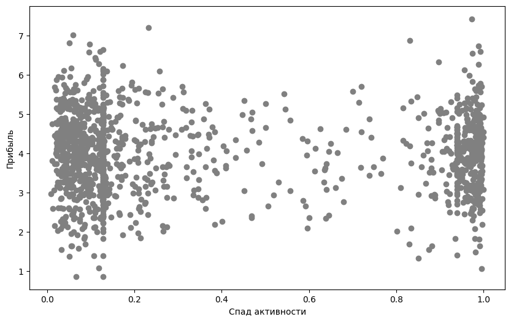
    


Визуально определила пороги, значения которых лучше всего разделяют данные на интересующие сегменты.  

Спад активности = 0.85
Прибыль = 2.5

Добавим пороговые линии на график


```python
plt.figure(figsize=(10,6))
plt.scatter(data=df, x='Спад активности', y='Прибыль', c='gray',
label="Визуализация данных")
action_threshold = 0.85
revenue_threshold = 2.5
plt.axvline( x=action_threshold, color='green', linestyle='--')
plt.axhline( y=revenue_threshold, color='green', linestyle='--')

plt.xlabel('Спад активности')
plt.ylabel('Прибыль')
plt.title("График рассеивания с порогами")
plt.legend()
plt.show()
```


    
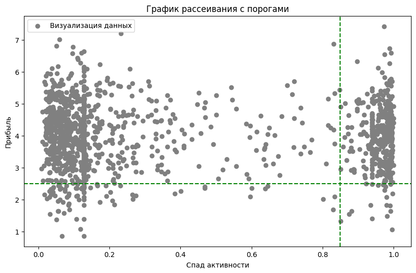
    


```python
#выделяем и визуализируем сегменты данных

high_revenue = df['Прибыль'] > revenue_threshold
low_actions = df['Спад активности'] > action_threshold

segment_mask = high_revenue & low_actions

plt.figure(figsize=(10,6))
plt.scatter(data=df, x='Спад активности', y='Прибыль', c='gray',
label="Сегмент")
plt.scatter(df['Спад активности'][segment_mask], df['Прибыль'][segment_mask]\
            , color='red', label="Остальные")

plt.axvline( x=action_threshold, color='blue', linestyle='--')
plt.axhline( y=revenue_threshold, color='green', linestyle='--')

plt.xlabel('Спад активности')
plt.ylabel('Прибыль')
plt.title("График рассеивания с порогами")
plt.legend()
plt.show()
```


    
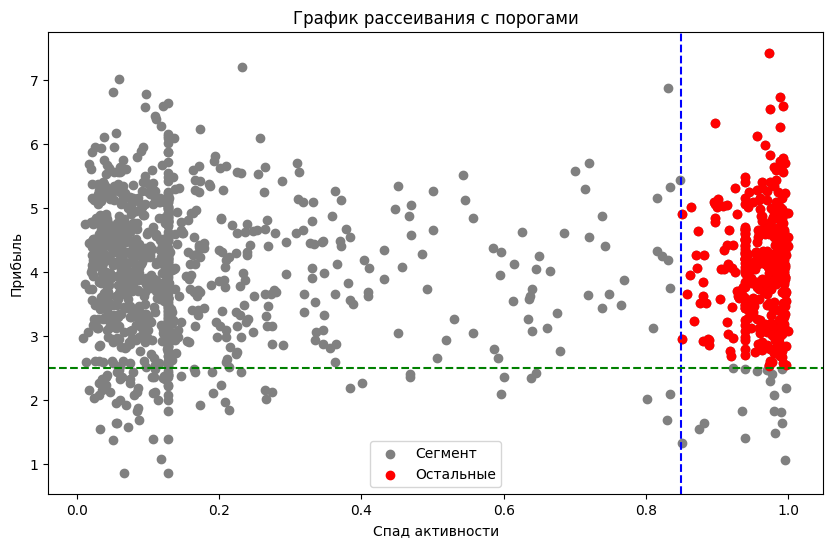
    


```python
# Определение сегмента "Высокоприбыльные неактивы"
passive_moneybags = df[
    (df['Спад активности'] > action_threshold) &
    (df['Прибыль'] > revenue_threshold)
]

print(f'Создан сегмент "Высокоприбыльные неактивы" с {len(passive_moneybags)} покупателями.')
```

    Создан сегмент "Высокоприбыльные неактивы" с 341 покупателями.


```python
others = df[df['Спад активности'] != 'Снизилась']

to_compare = (['Тип сервиса', 'Разрешить сообщать', 'Популярная_категория',
                     'Акционные_покупки']
                   )
activity_data = passive_moneybags[to_compare]

for column in to_compare:
    plt.figure(figsize=(10, 6))

    plt.hist(passive_moneybags[column], bins=30, alpha=0.5, color='r', label="Высокоприбыльные неактивы")

    plt.hist(others[column], bins=30, alpha=0.5, color='g', label='Остальные покупатели')


    plt.title(f'Распределение {column}')
    plt.xlabel(column)
    plt.ylabel('Количество')
    plt.legend()

    # Поворот названий категорий на вертикальные оси
    if df[column].dtype == 'object':
        plt.xticks(rotation='vertical')

    plt.show()
```


    
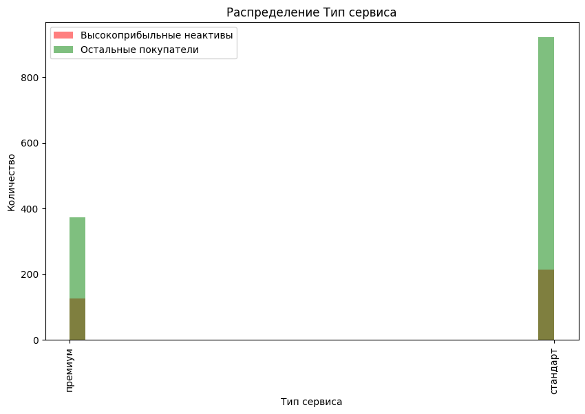
    


    
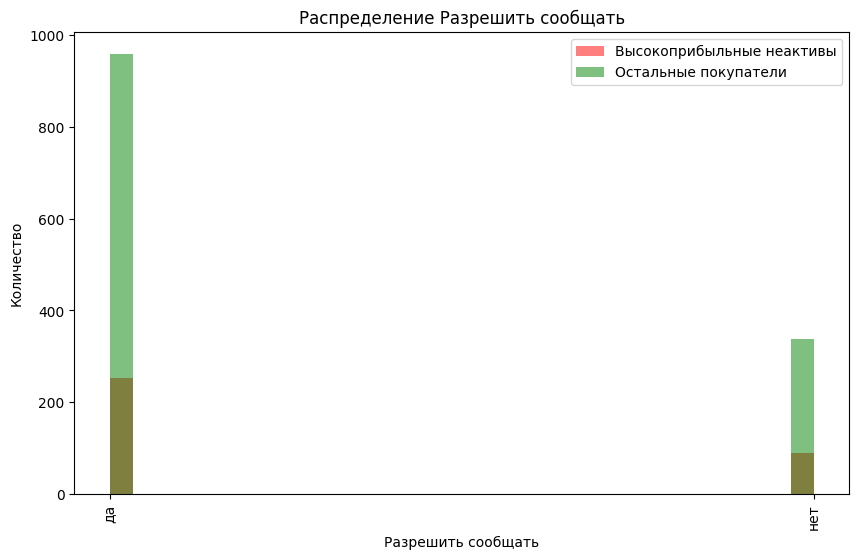
    


    
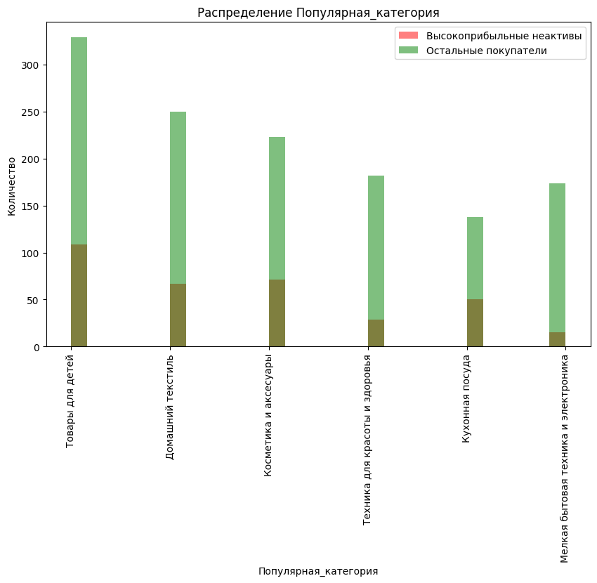
    


    
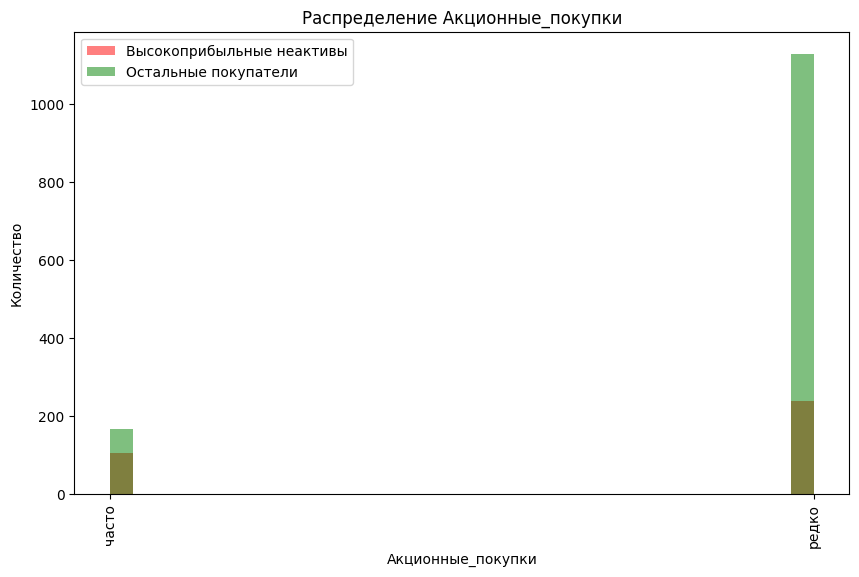
    


```python
plt.figure(figsize=(15, 10))

plt.subplot(1, 3, 1)
sns.histplot(df['Тип сервиса'], bins=20)
plt.title('Тип сервиса')


```


    Text(0.5, 1.0, 'Тип сервиса')


    
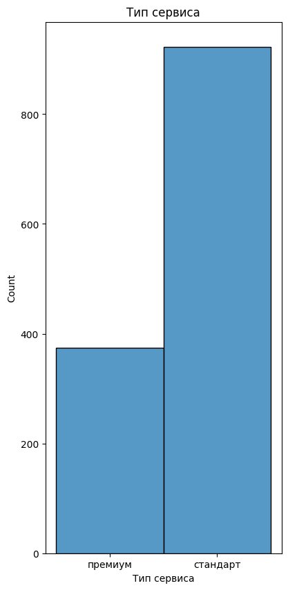
    


```python
df_final_type = df.groupby("Тип сервиса")
df_final_type.size()
```


    Тип сервиса
    премиум     374
    стандарт    922
    dtype: int64


Из этих данных можно сделать вывод, что одна треть клиентов с высокой прибыльностью, которые вероятнее всего снизят свою активность - это клиенты со стандартным типом сервиса.
Бизнесу необходимо подумать, как и чем завлечь клиентов и перейти на статус премум. Возможно, сейчас клиенты не видят явной привлектельности и дополнительных выгод в премиальном статусе.


```python
plt.figure(figsize=(15, 10))
plt.subplot(1, 3, 2)
sns.histplot(df['Разрешить сообщать'], bins=20)
plt.title('Разрешить сообщать')
```


    Text(0.5, 1.0, 'Разрешить сообщать')


    
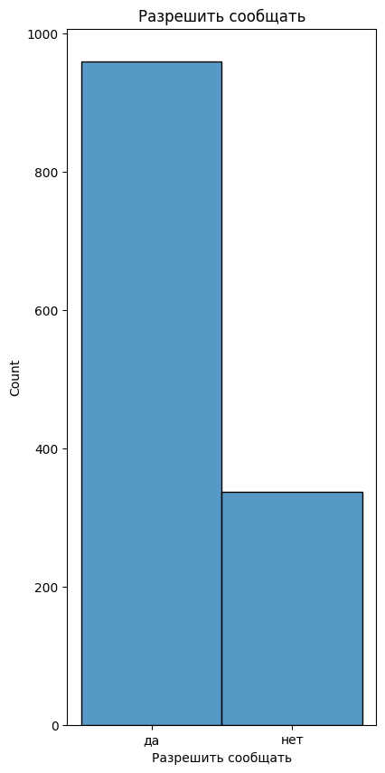
    


```python
df_final_messages = df.groupby("Разрешить сообщать")
df_final_messages.size()
```


    Разрешить сообщать
    да     959
    нет    337
    dtype: int64


Большая часть клиентов, котороя вероятнее всего снизит свою покупательскую активность дала разрешение на подписку. Стоит обратить на нее пристальное внимание: она может быть слишком надоедливой, раздражительной либо малоинформативной и привлекательной.


```python
plt.figure(figsize=(15, 10))
plt.subplot(1, 3, 3)
sns.histplot(df['Акционные_покупки'], bins=20)
plt.title('Акционные_покупки')
```


    Text(0.5, 1.0, 'Акционные_покупки')


    
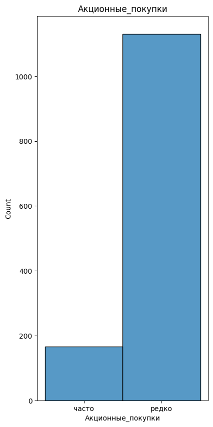
    


```python
df_final_sales = df.groupby("Акционные_покупки")
df_final_sales.size()
```


    Акционные_покупки
    редко    1130
    часто     166
    dtype: int64


Клиенты, у которых прогнозируется снижение активности практически не берут товары по акции. Возможно, необходимо пересмотреть политику установления акционных товаров, либо клиенты нативно не находят товары по акциям, которые интересно именно им.


```python
plt.figure(figsize=(50, 8))
plt.subplot(1, 3, 3)
sns.histplot(df['Популярная_категория'], bins=40)
plt.title('Популярная_категория')
```


    Text(0.5, 1.0, 'Популярная_категория')


    
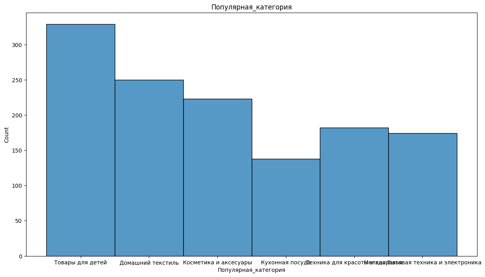
    


```python
df_final_type_of_service = df.groupby("Популярная_категория")
df_final_type_of_service.size()
```


    Популярная_категория
    Домашний текстиль                       250
    Косметика и аксесуары                   223
    Кухонная посуда                         138
    Мелкая бытовая техника и электроника    174
    Техника для красоты и здоровья          182
    Товары для детей                        329
    dtype: int64


Следует проверить ассортимент в таких категорях как "Косметика и аксесуары" и "Товары для детей". Возможно, он устарел, не досточно широк и цены не конкурентно способны.

Вывод по выбранному сегменту.  
1. Компании необходимо пересмотреть условия премиум сегмента. Сделать его более привлекательным для клиентов и донести до них эти выгоды. Раз клиенты с премиум сегментов реже склонны к снижению активнсти, значит, выгоды все-таки есть, но клиенты из стандартного сегмента этих выгод не видят либо не знают о них.   
Вторая причина, по которой у клиентов из стандарного сегмента падает активность, может быть в том, что слишком много акций и выгод придумывается для премум сегмента и мало псоздается интересных кампаний для стандартного сегмента.
2. Необходимо наладить коммуникацию с клиентами, так как пока клиенты, с которыми не коммуницируют представители компании менее склонна к снижению активности. Возможно, коммуникация слишком навязчивая, раздражительная и неинформативная.
3. Клиенты со сниженной активностью редко покупают акционные товары. Возможно, рекомендательная система плохо настроена и они просто ен выдят выгодные для них акционные позиции, а интересующие товары без акций по каким-то причинам не выгодны. Возможно, цены завышены по отношению к конкурентам.
4. Следует проверить ассортимент в таких категорях как "Косметика и аксесуары" и "Товары для детей". Возможно, он устарел, не досточно широк и цены не конкурентно способны.

**Шаг 7. Общий вывод по проекту.**

1. По завершении проекта удалось построить модель с очень хорошими показателями, которая сможет прдесказывать снижение покупательской активности у клиентов на потяжении последующих трех месяцев.
2. В ходе решения задачи были удалены анамалии, исправлены неявные дубликаты, проведен исследоватеьлский анализ данных, включены дополнительные данные фин департамента.
3. Проведен корреляционный анализ признаков методом Фи, так как установлена нелинейная зависимость. По итогу анализа, мультиколлиниарность не выявлена.
4. Для кодирования категориальных признаков использовали два кодировщика, для масштабирования количественных — два скейлера.Обучили четыре модели: KNeighborsClassifier(), DecisionTreeClassifier(), LogisticRegression() и  SVC(). Качество моделей было оценено метрикой ROC-AUC.
5. Мы нашли лучшую модель для обучения. Ей оказалась SVC с параметрами C=1 и random_state=42.
6. Был выбран сегмент клиентов с высокой вероятностью снижения активности, но которые принрсят значительную прибыль компании. Тщательно проанализировав данный сегмент, был сделан вывод, что  

а) необходимо пересмотреть условия премиум сегмента;

b) необходимо наладить коммуникацию с клиентами;

с) клиенты со сниженной активностью редко покупают акционные товары;   

d) cледует проверить ассортимент, в таких категорях как "Косметика и аксесуары" и "Товары для детей".

